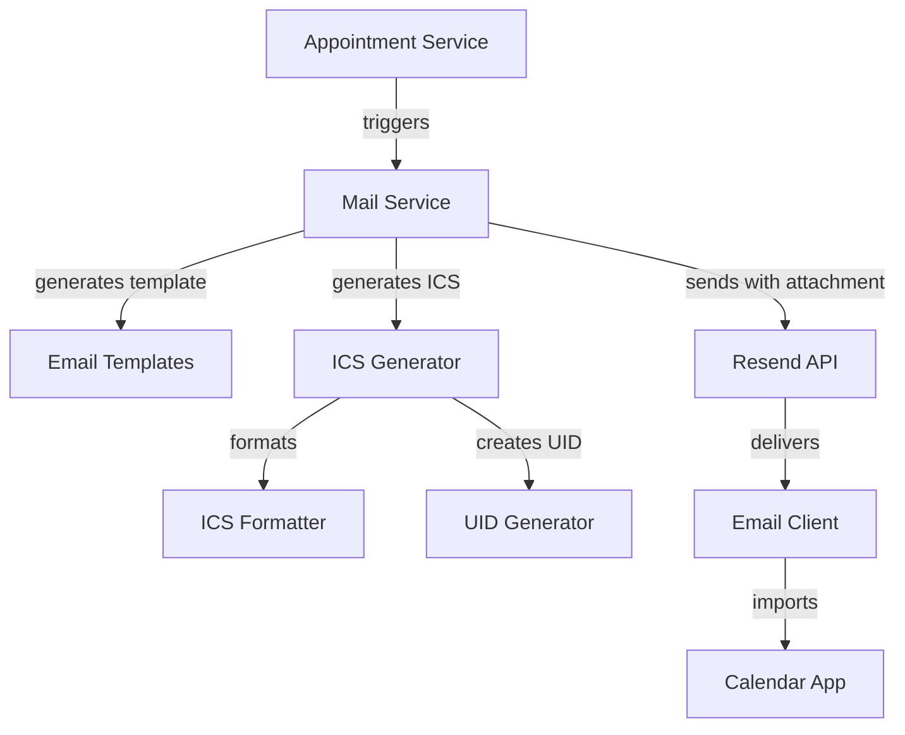

# Design Document: Appointment Calendar ICS

## Overview

This feature adds iCalendar (.ics) file attachments to appointment emails, enabling clients to seamlessly add appointments to their calendar applications. The system will generate RFC 5545-compliant ICS files containing event details and attach them to all appointment lifecycle emails (booked, confirmed, cancelled, reminder).

The implementation extends the existing email service (`mailService.ts`) by introducing an ICS generator module that produces properly formatted calendar data. The Resend API already supports attachments, so we'll leverage its existing attachment capabilities to include the generated ICS files.

Key design considerations:
- RFC 5545 compliance for maximum email client compatibility
- Deterministic UID generation for proper event updates and cancellations
- Timezone handling for Argentina/Buenos Aires (UTC-3)
- Special character escaping and line folding per RFC specifications
- Round-trip validation to ensure data integrity

## Architecture

### Component Overview



### Module Responsibilities

**ICS Generator Module** (`backend/src/services/icsGenerator.ts`)
- Generates RFC 5545-compliant iCalendar data
- Handles VEVENT and VTIMEZONE components
- Manages event properties (summary, description, timestamps, etc.)
- Generates deterministic UIDs based on appointment ID
- Handles cancellation events with METHOD:CANCEL

**ICS Formatter Module** (`backend/src/services/icsFormatter.ts`)
- Implements RFC 5545 formatting rules
- Handles line folding (75 octet limit)
- Escapes special characters (comma, semicolon, backslash, newline)
- Formats timestamps in UTC with TZID parameters
- Implements CRLF line breaks

**Mail Service Updates** (`backend/src/services/mailService.ts`)
- Modified to accept optional ICS attachment
- Passes attachment to Resend API with proper MIME type
- Coordinates between template generation and ICS generation

### Data Flow

1. Appointment service triggers email send (booked/confirmed/cancelled/reminder)
2. Mail service receives appointment data
3. ICS generator creates calendar event data
4. ICS formatter applies RFC 5545 formatting rules
5. Mail service combines email template with ICS attachment
6. Resend API sends email with attachment
7. Email client receives and displays ICS file
8. User clicks to add to calendar
9. Calendar application imports event

## Components and Interfaces

### ICS Generator Interface

```typescript
interface ICSEventData {
  uid: string;
  summary: string;
  description?: string;
  startTime: Date;
  durationMinutes: number;
  organizerName: string;
  attendeeName: string;
  attendeeEmail: string;
  status: 'CONFIRMED' | 'CANCELLED';
  method: 'REQUEST' | 'CANCEL';
  notes?: string | null;
}

interface ICSGeneratorOptions {
  appointmentId: string;
  patientName: string;
  patientEmail: string;
  professionalName: string;
  scheduledAt: Date;
  durationMinutes: number;
  notes?: string | null;
  isCancellation?: boolean;
}

function generateICS(options: ICSGeneratorOptions): string;
function generateUID(appointmentId: string): string;
```

### ICS Formatter Interface

```typescript
interface ICSFormatterOptions {
  foldLines?: boolean;
  escapeSpecialChars?: boolean;
}

function formatICSLine(key: string, value: string, options?: ICSFormatterOptions): string;
function escapeICSText(text: string): string;
function foldLine(line: string, maxLength?: number): string;
function formatICSTimestamp(date: Date, timezone?: string): string;
```

### Mail Service Updates

```typescript
interface EmailAttachment {
  filename: string;
  content: string;
  type: string;
}

async function send(
  to: string,
  subject: string,
  html: string,
  text: string,
  attachments?: EmailAttachment[]
): Promise<void>;
```

### Resend API Attachment Format

The Resend API accepts attachments in the following format:

```typescript
{
  from: string;
  to: string;
  subject: string;
  html: string;
  text: string;
  attachments?: Array<{
    filename: string;
    content: string | Buffer;
    type?: string;
  }>;
}
```

## Data Models

### ICS File Structure

The generated ICS file follows RFC 5545 structure:

```
BEGIN:VCALENDAR
VERSION:2.0
PRODID:-//AnamnesIA//Appointment Calendar//ES
METHOD:REQUEST
CALSCALE:GREGORIAN
BEGIN:VTIMEZONE
TZID:America/Argentina/Buenos_Aires
BEGIN:STANDARD
DTSTART:19700101T000000
TZOFFSETFROM:-0300
TZOFFSETTO:-0300
END:STANDARD
END:VTIMEZONE
BEGIN:VEVENT
UID:appointment-{uuid}@anamnesia.pro
DTSTAMP:{timestamp}
DTSTART;TZID=America/Argentina/Buenos_Aires:{start}
DTEND;TZID=America/Argentina/Buenos_Aires:{end}
SUMMARY:{professionalName} - Consulta
DESCRIPTION:{notes}
ORGANIZER;CN={professionalName}:noreply@anamnesia.pro
ATTENDEE;CN={patientName};RSVP=FALSE:mailto:{patientEmail}
STATUS:CONFIRMED
SEQUENCE:0
END:VEVENT
END:VCALENDAR
```

### Cancellation Event Structure

For cancelled appointments, the METHOD and STATUS change:

```
BEGIN:VCALENDAR
VERSION:2.0
METHOD:CANCEL
...
BEGIN:VEVENT
UID:appointment-{uuid}@anamnesia.pro
STATUS:CANCELLED
SEQUENCE:1
...
END:VEVENT
END:VCALENDAR
```

### UID Format

UIDs follow the format: `appointment-{appointmentId}@anamnesia.pro`

This ensures:
- Uniqueness across all appointments
- Deterministic generation (same appointment = same UID)
- RFC 5545 compliance (includes domain portion)
- Proper event updates when status changes

### Timestamp Formats

**DTSTAMP**: UTC timestamp in format `YYYYMMDDTHHmmssZ`
- Example: `20240315T143000Z`

**DTSTART/DTEND**: Local time with TZID parameter
- Format: `DTSTART;TZID=America/Argentina/Buenos_Aires:YYYYMMDDTHHmmss`
- Example: `DTSTART;TZID=America/Argentina/Buenos_Aires:20240315T113000`

### Special Character Escaping

Per RFC 5545, the following characters must be escaped in text fields:
- Comma (`,`) → `\,`
- Semicolon (`;`) → `\;`
- Backslash (`\`) → `\\`
- Newline (`\n`) → `\\n`

### Line Folding

Lines exceeding 75 octets must be folded:
- Break line at 75 characters
- Continue on next line with a space or tab prefix
- Example:
  ```
  DESCRIPTION:This is a very long description that exceeds the seventy-five
   character limit and must be folded according to RFC 5545 specifications
  ```


## Correctness Properties

*A property is a characteristic or behavior that should hold true across all valid executions of a system—essentially, a formal statement about what the system should do. Properties serve as the bridge between human-readable specifications and machine-verifiable correctness guarantees.*

### Property Reflection

After analyzing all acceptance criteria, I identified several redundancies:

- **Redundancy 1**: Criteria 5.5 (round-trip property) subsumes 1.1 (RFC 5545 conformance). If we can successfully parse what we generate, it's valid by definition.
- **Redundancy 2**: Criteria 5.4 (newline escaping) is a specific case of 5.3 (special character escaping). We can test all special characters together.
- **Redundancy 3**: Criteria 4.3 (same UID for all emails) is redundant with 4.2 (deterministic UID generation). If generation is deterministic, the same appointment will always produce the same UID.
- **Redundancy 4**: Criteria 1.2, 1.6, 1.7, 7.1, 7.2, 7.3 all test for presence of specific fields. These can be combined into a single comprehensive property about required field presence.
- **Redundancy 5**: Criteria 2.1, 2.2, 2.3 all test that attachments are present for different email types. These can be combined into one property.
- **Redundancy 6**: Criteria 2.4 and 2.5 test attachment metadata. These can be combined into one property about attachment format.

The following properties represent the minimal, non-redundant set needed for comprehensive validation:

### Property 1: ICS Round-Trip Preservation

*For any* valid appointment data, generating ICS data then parsing it back should produce equivalent event information (start time, end time, summary, description, organizer, attendee, status).

**Validates: Requirements 1.1, 5.5**

### Property 2: Required Fields Presence

*For any* generated ICS file, it must contain all required components and fields: VCALENDAR wrapper, VEVENT component, VTIMEZONE component, UID, DTSTAMP, DTSTART, DTEND, SUMMARY, ORGANIZER, ATTENDEE, and STATUS fields.

**Validates: Requirements 1.2, 1.3, 1.6, 1.7, 7.1, 7.3**

### Property 3: End Time Calculation

*For any* start time and duration in minutes, the DTEND timestamp should equal the DTSTART timestamp plus the duration.

**Validates: Requirements 1.4**

### Property 4: Timestamp Format Compliance

*For any* generated ICS file, DTSTAMP should be in UTC format (YYYYMMDDTHHmmssZ) and DTSTART/DTEND should include TZID parameter with America/Argentina/Buenos_Aires timezone.

**Validates: Requirements 1.5**

### Property 5: Notes Inclusion

*For any* appointment with non-null notes, the generated ICS DESCRIPTION field should contain those notes with proper escaping.

**Validates: Requirements 7.2**

### Property 6: Attachment Presence for Non-Cancellation Emails

*For any* appointment email of type booked, confirmed, or reminder, the email payload must include an ICS attachment.

**Validates: Requirements 2.1, 2.2, 2.3**

### Property 7: Attachment Format

*For any* email with an ICS attachment, the attachment filename must be "appointment.ics" and the MIME type must be "text/calendar".

**Validates: Requirements 2.4, 2.5**

### Property 8: Cancellation Method and Status

*For any* cancelled appointment, the generated ICS must contain METHOD:CANCEL in the VCALENDAR component and STATUS:CANCELLED in the VEVENT component.

**Validates: Requirements 3.1, 3.2**

### Property 9: UID Uniqueness

*For any* two appointments with different appointment IDs, their generated UIDs must be different.

**Validates: Requirements 4.1**

### Property 10: UID Determinism

*For any* appointment ID, generating the UID multiple times should always produce the same result.

**Validates: Requirements 4.2, 4.3, 3.3**

### Property 11: CRLF Line Breaks

*For any* generated ICS file, all line breaks must use CRLF (\\r\\n) format, not just LF (\\n).

**Validates: Requirements 5.1**

### Property 12: Line Folding

*For any* generated ICS file, no unfolded line should exceed 75 octets in length.

**Validates: Requirements 5.2**

### Property 13: Special Character Escaping

*For any* text field containing special characters (comma, semicolon, backslash, newline), those characters must be properly escaped in the generated ICS (\\, → \\\\,, \\; → \\\\;, \\\\ → \\\\\\\\, newline → \\\\n).

**Validates: Requirements 5.3, 5.4**

### Property 14: Confirmed Status for Active Appointments

*For any* appointment with status 'pending', 'confirmed', or 'completed', the generated ICS event STATUS should be CONFIRMED.

**Validates: Requirements 7.4**

## Error Handling

### Invalid Input Handling

**Missing Required Fields**
- If appointment ID is missing, throw `InvalidAppointmentError`
- If scheduledAt is missing or invalid, throw `InvalidDateError`
- If durationMinutes is missing or non-positive, throw `InvalidDurationError`
- If patient email is missing for attendee, throw `MissingAttendeeError`

**Invalid Date/Time Values**
- If scheduledAt is in the past (for new appointments), log warning but proceed
- If durationMinutes exceeds 24 hours, log warning but proceed
- If date parsing fails, throw `DateParseError`

**Text Field Validation**
- If professional name or patient name is empty, use default value "Unknown"
- If notes exceed 10,000 characters, truncate with "..." suffix
- Null or undefined notes should be omitted from DESCRIPTION field

### ICS Generation Failures

**Formatting Errors**
- If line folding fails, log error and return unfolded content
- If character escaping fails, log error and return unescaped content
- If timestamp formatting fails, throw `TimestampFormatError`

**UID Generation Failures**
- If appointment ID is invalid UUID format, throw `InvalidUUIDError`
- UID generation should never fail for valid UUID input

### Email Sending Failures

**Attachment Failures**
- If ICS generation fails, log error and send email without attachment
- If attachment size exceeds Resend limit (10MB), log error and skip attachment
- Email should still be sent even if attachment fails

**Resend API Failures**
- Network errors: retry up to 3 times with exponential backoff
- API errors (4xx): log error and don't retry
- Rate limiting (429): wait and retry after specified delay
- All email failures should be logged but not throw exceptions

### Graceful Degradation

The system should prioritize email delivery over attachment inclusion:
1. Attempt to generate ICS attachment
2. If ICS generation fails, log error and proceed without attachment
3. Send email with or without attachment
4. Log success/failure for monitoring

This ensures clients always receive appointment notifications even if calendar integration fails.

## Testing Strategy

### Dual Testing Approach

This feature requires both unit tests and property-based tests for comprehensive coverage:

**Unit Tests** focus on:
- Specific examples of ICS generation with known inputs/outputs
- Edge cases (empty notes, very long text, special characters)
- Error conditions (missing fields, invalid dates)
- Integration points (email service, Resend API)
- Cancellation event generation

**Property-Based Tests** focus on:
- Universal properties that hold for all inputs
- Round-trip validation (generate → parse → compare)
- Format compliance (line folding, character escaping, CRLF)
- UID generation (uniqueness, determinism)
- Field presence and correctness across random inputs

Together, these approaches provide comprehensive coverage: unit tests catch concrete bugs in specific scenarios, while property tests verify general correctness across the input space.

### Property-Based Testing Configuration

**Library Selection**: Use `fast-check` for TypeScript property-based testing

**Test Configuration**:
- Minimum 100 iterations per property test (due to randomization)
- Each property test must reference its design document property
- Tag format: `Feature: appointment-calendar-ics, Property {number}: {property_text}`

**Example Property Test Structure**:

```typescript
import fc from 'fast-check';

// Feature: appointment-calendar-ics, Property 1: ICS Round-Trip Preservation
test('generated ICS can be parsed back to equivalent data', () => {
  fc.assert(
    fc.property(
      appointmentDataArbitrary(),
      (appointmentData) => {
        const ics = generateICS(appointmentData);
        const parsed = parseICS(ics);
        expect(parsed.startTime).toEqual(appointmentData.scheduledAt);
        expect(parsed.durationMinutes).toEqual(appointmentData.durationMinutes);
        expect(parsed.summary).toContain(appointmentData.professionalName);
        // ... additional assertions
      }
    ),
    { numRuns: 100 }
  );
});
```

**Arbitrary Generators**:

Create generators for random test data:
- `appointmentDataArbitrary()`: generates random appointment data
- `appointmentIdArbitrary()`: generates valid UUID strings
- `dateArbitrary()`: generates random dates within reasonable range
- `durationArbitrary()`: generates durations between 15-240 minutes
- `textWithSpecialCharsArbitrary()`: generates text with special characters
- `longTextArbitrary()`: generates text exceeding 75 characters for folding tests

### Unit Test Coverage

**ICS Generator Tests**:
- Generate ICS for booked appointment
- Generate ICS for confirmed appointment
- Generate ICS for cancelled appointment
- Generate ICS with notes
- Generate ICS without notes
- Handle empty professional name
- Handle empty patient name
- Handle very long notes (>10,000 chars)

**ICS Formatter Tests**:
- Escape comma in text
- Escape semicolon in text
- Escape backslash in text
- Escape newline in text
- Fold line at 75 characters
- Fold line with multi-byte UTF-8 characters
- Format UTC timestamp
- Format local timestamp with TZID
- Apply CRLF line breaks

**UID Generator Tests**:
- Generate UID from valid UUID
- Generate same UID for same appointment ID
- Generate different UIDs for different appointment IDs
- Handle invalid UUID format

**Mail Service Integration Tests**:
- Send booked email with ICS attachment
- Send confirmed email with ICS attachment
- Send cancelled email with ICS attachment
- Send reminder email with ICS attachment
- Handle ICS generation failure gracefully
- Verify attachment filename and MIME type

### Manual Testing Requirements

**Email Client Compatibility** (Requirements 6.1-6.4):
- Test ICS import in Gmail web interface
- Test ICS import in Outlook desktop client
- Test ICS import in Apple Mail
- Test ICS import in iOS Mail app
- Test ICS import in Android Gmail app
- Verify cancellation updates remove events from calendar
- Verify event details display correctly in each client

**End-to-End Testing**:
- Book appointment → receive email → add to calendar
- Confirm appointment → receive email → calendar updates
- Cancel appointment → receive email → calendar removes event
- Receive reminder → add to calendar (if not already added)

### Test Data

Use realistic test data based on actual appointment scenarios:
- Professional names: "Dr. María González", "Lic. Juan Pérez"
- Patient names: "Ana Martínez", "Carlos López"
- Durations: 30, 45, 60, 90 minutes
- Notes: Spanish text with accents, line breaks, special characters
- Dates: Various times throughout the day, different days of week

### Continuous Integration

All tests should run on every commit:
- Unit tests: fast feedback (<5 seconds)
- Property tests: comprehensive coverage (~30 seconds)
- Integration tests: verify email service integration (~10 seconds)
- Manual tests: performed before release

Target: 90%+ code coverage for ICS generator and formatter modules.
