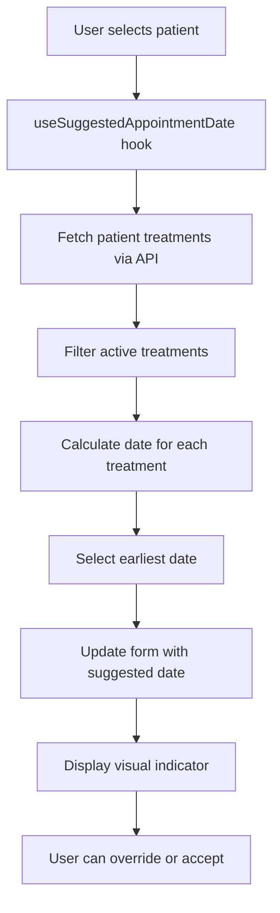

# Design Document: Appointment Scheduling Suggestions

## Overview

This feature implements an intelligent appointment scheduling suggestion system that calculates recommended dates for new appointments based on patient treatment history and treatment frequency protocols. The system analyzes a patient's active treatments, determines their current phase (initial vs maintenance), and suggests the next appropriate appointment date according to medical best practices.

The solution is implemented entirely on the client side for optimal performance, calculating suggestions in real-time as the user selects a patient in the appointment form. The suggested date serves as a helpful default that doctors can override with any date they choose.

### Key Design Decisions

1. **Client-side calculation**: All date calculations happen in the browser to minimize latency and provide instant feedback when selecting a patient.

2. **Earliest date selection**: When a patient has multiple active treatments with different frequencies, the system suggests the earliest calculated date to ensure no treatment falls behind schedule.

3. **Graceful degradation**: The system handles missing or incomplete data gracefully, defaulting to the current date when calculations cannot be performed.

4. **Non-blocking UX**: Suggested dates are presented as helpful defaults that never prevent the doctor from selecting any date they prefer.

## Architecture

### Component Structure

```
AppointmentsPage
  └── NewAppointmentSheet
        ├── Patient selector (triggers suggestion calculation)
        ├── Date picker (displays suggested date with visual indicator)
        └── useSuggestedAppointmentDate hook (calculation logic)
```

### Data Flow



### API Integration

The feature relies on existing API endpoints:

- `GET /patient-treatments/patient/:patientId` - Retrieves all patient treatments with nested treatment details
- `GET /appointments/:id` - Retrieves appointment details when needed for last appointment date

No new backend endpoints are required.

## Components and Interfaces

### 1. useSuggestedAppointmentDate Hook

A custom React hook that encapsulates the suggestion calculation logic.

```typescript
interface UseSuggestedAppointmentDateOptions {
  patientId: string | null;
  enabled?: boolean;
}

interface UseSuggestedAppointmentDateResult {
  suggestedDate: Date | null;
  loading: boolean;
  error: Error | null;
  calculationDetails: SuggestionCalculationDetails | null;
}

interface SuggestionCalculationDetails {
  treatmentsConsidered: number;
  selectedTreatmentId: string | null;
  selectedTreatmentName: string | null;
  phase: 'initial' | 'maintenance' | null;
  frequencyWeeks: number | null;
  lastAppointmentDate: Date | null;
}

function useSuggestedAppointmentDate(
  options: UseSuggestedAppointmentDateOptions
): UseSuggestedAppointmentDateResult
```

**Responsibilities:**
- Fetch patient treatments when patientId changes
- Calculate suggested date based on treatment protocols
- Provide calculation details for UI display
- Handle loading and error states

### 2. SuggestedDateIndicator Component

A visual component that displays the suggested date information to the user.

```typescript
interface SuggestedDateIndicatorProps {
  calculationDetails: SuggestionCalculationDetails | null;
  isModified: boolean;
}

function SuggestedDateIndicator(props: SuggestedDateIndicatorProps): JSX.Element
```

**Responsibilities:**
- Display explanatory text about why the date was suggested
- Show which treatment drove the suggestion
- Indicate when the user has modified the suggested date
- Provide subtle visual styling that doesn't distract

### 3. NewAppointmentSheet Modifications

The existing `NewAppointmentSheet` component will be enhanced to:

- Call `useSuggestedAppointmentDate` when a patient is selected
- Update the form date when a suggestion is calculated
- Display the `SuggestedDateIndicator` component
- Track whether the user has manually modified the suggested date

## Data Models

### PatientTreatment (existing)

```typescript
interface PatientTreatment {
  id: string;
  tenant_id: string;
  patient_id: string;
  treatment_id: string;
  current_session: number;
  started_at: string | null;
  last_appointment_id: string | null;
  is_active: boolean;
  completed_at: string | null;
  created_at: string | null;
  updated_at: string | null;
  treatment?: Treatment | null;
}
```

### Treatment (existing)

```typescript
interface Treatment {
  id: string;
  tenant_id: string;
  name: string;
  price_cents: number;
  initial_frequency_weeks: number | null;
  initial_sessions_count: number | null;
  maintenance_frequency_weeks: number | null;
  protocol_notes: string | null;
  created_at: string | null;
  updated_at: string | null;
}
```

### Appointment (existing)

```typescript
interface Appointment {
  id: string;
  tenant_id: string;
  patient_id: string;
  scheduled_at: string;
  duration_minutes: number | null;
  status: 'pending' | 'confirmed' | 'completed' | 'cancelled' | 'no-show';
  // ... other fields
}
```

### Calculation Algorithm

The suggestion calculation follows this algorithm:

```typescript
function calculateSuggestedDate(patientTreatments: PatientTreatment[]): Date | null {
  // 1. Filter to active treatments only
  const activeTreatments = patientTreatments.filter(pt => pt.is_active);
  
  if (activeTreatments.length === 0) {
    return null;
  }
  
  // 2. Calculate suggested date for each treatment
  const suggestions: Array<{ date: Date; treatment: PatientTreatment }> = [];
  
  for (const pt of activeTreatments) {
    const treatment = pt.treatment;
    if (!treatment) continue;
    
    // Determine phase
    const inInitialPhase = 
      treatment.initial_sessions_count !== null &&
      pt.current_session <= treatment.initial_sessions_count;
    
    // Get frequency
    const frequencyWeeks = inInitialPhase
      ? treatment.initial_frequency_weeks
      : treatment.maintenance_frequency_weeks;
    
    if (frequencyWeeks === null || frequencyWeeks === 0) continue;
    
    // Get last appointment date
    const lastAppointmentDate = await getLastAppointmentDate(pt.last_appointment_id);
    const baseDate = lastAppointmentDate ?? new Date();
    
    // Calculate next date
    const suggestedDate = addWeeks(baseDate, frequencyWeeks);
    
    // Don't suggest dates in the past
    if (suggestedDate < new Date()) {
      suggestions.push({ date: new Date(), treatment: pt });
    } else {
      suggestions.push({ date: suggestedDate, treatment: pt });
    }
  }
  
  if (suggestions.length === 0) {
    return null;
  }
  
  // 3. Return earliest date
  suggestions.sort((a, b) => a.date.getTime() - b.date.getTime());
  return suggestions[0].date;
}
```


## Correctness Properties

A property is a characteristic or behavior that should hold true across all valid executions of a system—essentially, a formal statement about what the system should do. Properties serve as the bridge between human-readable specifications and machine-verifiable correctness guarantees.

### Property 1: Suggestion triggers on patient selection

For any patient selection in the appointment form, the system should initiate a suggestion calculation that produces either a suggested date or null.

**Validates: Requirements 1.1**

### Property 2: Calculated suggestions populate the form

For any successfully calculated suggested date, the appointment form's date field should be populated with that calculated value.

**Validates: Requirements 1.2**

### Property 3: Date picker remains editable

For any suggested date displayed in the form, the date picker should remain fully editable and accept any date value the user selects.

**Validates: Requirements 1.5, 6.5**

### Property 4: Active treatments filter

For any patient with multiple patient treatments, only those with is_active = true should be considered in the suggestion calculation.

**Validates: Requirements 2.1, 4.5**

### Property 5: All active treatments with protocols produce calculations

For any active patient treatment with either initial_frequency_weeks or maintenance_frequency_weeks defined (non-null and non-zero), the system should calculate a suggested date for that treatment.

**Validates: Requirements 2.2**

### Property 6: Phase-appropriate frequency selection

For any patient treatment, if the treatment is in the initial phase (current_session <= initial_sessions_count), the system should use initial_frequency_weeks; otherwise, it should use maintenance_frequency_weeks.

**Validates: Requirements 2.3, 2.4, 2.5**

### Property 7: Phase classification by session count

For any patient treatment with initial_sessions_count defined, the system should classify it as initial phase when current_session <= initial_sessions_count, and as maintenance phase when current_session > initial_sessions_count.

**Validates: Requirements 3.1, 3.2, 3.3**

### Property 8: Treatments without protocols are excluded

For any patient treatment where both initial_frequency_weeks and maintenance_frequency_weeks are null or zero, that treatment should not contribute to the suggested date calculation.

**Validates: Requirements 3.5, 7.3**

### Property 9: Independent calculation per treatment

For any patient with multiple active treatments, the system should calculate a suggested date for each treatment independently, without one treatment's calculation affecting another's.

**Validates: Requirements 4.1**

### Property 10: Earliest date selection

For any set of calculated suggested dates from multiple treatments, the system should select and return the earliest date as the primary suggestion.

**Validates: Requirements 4.2, 4.3**

### Property 11: Last appointment date retrieval

For any patient treatment with a last_appointment_id, the system should retrieve that appointment's scheduled_at date to use as the base for calculation.

**Validates: Requirements 5.1**

### Property 12: Date calculation from last appointment

For any patient treatment with a last appointment date and a frequency value, the suggested date should equal the last appointment date plus (frequency_weeks * 7) days.

**Validates: Requirements 5.2, 5.4**

### Property 13: Date format compatibility

For any calculated suggested date, the returned value should be a valid JavaScript Date object compatible with the date picker component.

**Validates: Requirements 5.5**

### Property 14: Explanatory text generation

For any calculated suggested date, the system should generate explanatory text that includes the treatment name and frequency information.

**Validates: Requirements 6.2**

### Property 15: Modification tracking

For any suggested date in the form, when the user manually changes the date value, the system should update a modification flag to indicate the suggestion has been overridden.

**Validates: Requirements 6.3**

### Property 16: Suggestion persistence until modification

For any suggested date set in the form, that date should remain in the date field until the user explicitly changes it or selects a different patient.

**Validates: Requirements 6.4**

### Property 17: Past date handling

For any calculated suggested date that falls before the current date, the system should return the current date instead.

**Validates: Requirements 7.4**

### Property 18: Error handling with graceful fallback

For any error that occurs during suggestion calculation, the system should catch the error, log it, and return the current date as a fallback.

**Validates: Requirements 7.5**

### Property 19: Request cancellation on patient change

For any pending suggestion calculation, when the user selects a different patient, the system should cancel the previous calculation request.

**Validates: Requirements 8.4**

## Error Handling

### Client-Side Errors

1. **Network Failures**: When the API request to fetch patient treatments fails, the hook should:
   - Set the error state with the failure details
   - Return null for suggestedDate
   - Log the error to the console
   - Allow the form to continue functioning with manual date selection

2. **Invalid Data**: When patient treatment data is malformed or missing required fields:
   - Skip the invalid treatment in calculations
   - Continue processing other valid treatments
   - Log a warning about the invalid data
   - Return a suggestion based on valid treatments if any exist

3. **Calculation Errors**: When date arithmetic fails or produces invalid results:
   - Catch the error in a try-catch block
   - Log the error with context (patient ID, treatment ID)
   - Return the current date as a safe fallback
   - Display a subtle warning to the user (optional)

4. **Missing Appointment Data**: When last_appointment_id references a non-existent appointment:
   - Use the current date as the base for calculation
   - Log a warning about the missing reference
   - Continue with the calculation using the fallback date

### Edge Cases

1. **No Active Treatments**: Return null, allowing the form to default to current date
2. **All Treatments Lack Protocols**: Return null, allowing the form to default to current date
3. **Multiple Treatments with Same Date**: Return that date (earliest date logic handles this naturally)
4. **Patient with No Treatment History**: Return null immediately without API calls
5. **Rapid Patient Selection Changes**: Cancel previous requests using AbortController

### User-Facing Error Messages

The system should avoid showing error messages for suggestion failures, as the feature is non-blocking. Instead:
- The date picker should simply show the current date
- The suggestion indicator should not appear
- The form remains fully functional for manual date entry
- Errors are logged for debugging purposes only

## Testing Strategy

### Unit Testing

Unit tests should focus on specific examples and edge cases:

1. **Phase Determination Logic**
   - Test with current_session = 3, initial_sessions_count = 5 (initial phase)
   - Test with current_session = 6, initial_sessions_count = 5 (maintenance phase)
   - Test with null initial_sessions_count (defaults to maintenance)

2. **Date Calculation Examples**
   - Test adding 2 weeks to a known date produces expected result
   - Test adding 4 weeks to a known date produces expected result
   - Test that past dates are replaced with current date

3. **Edge Cases**
   - Empty patient treatments array returns null
   - All inactive treatments returns null
   - All treatments without frequencies returns null
   - Invalid last_appointment_id falls back to current date

4. **Error Handling**
   - API failure returns null and sets error state
   - Malformed data is skipped gracefully
   - Calculation errors return current date

### Property-Based Testing

Property tests should verify universal properties across randomized inputs. Each test should run a minimum of 100 iterations.

**Property Test Library**: Use `fast-check` for TypeScript/JavaScript property-based testing.

**Test Configuration**: Each property test must include a comment tag referencing the design property:
```typescript
// Feature: appointment-scheduling-suggestions, Property 4: Active treatments filter
```

**Property Test Examples**:

1. **Property 4: Active treatments filter**
   - Generate: Random arrays of patient treatments with varying is_active flags
   - Test: Only treatments with is_active = true are included in calculations
   - Tag: `Feature: appointment-scheduling-suggestions, Property 4: Active treatments filter`

2. **Property 6: Phase-appropriate frequency selection**
   - Generate: Random patient treatments with varying session counts and frequencies
   - Test: Initial phase uses initial_frequency_weeks, maintenance uses maintenance_frequency_weeks
   - Tag: `Feature: appointment-scheduling-suggestions, Property 6: Phase-appropriate frequency selection`

3. **Property 7: Phase classification by session count**
   - Generate: Random current_session and initial_sessions_count values
   - Test: Phase classification matches the comparison logic
   - Tag: `Feature: appointment-scheduling-suggestions, Property 7: Phase classification by session count`

4. **Property 10: Earliest date selection**
   - Generate: Random sets of treatments with different frequencies
   - Test: The returned suggestion is always the earliest calculated date
   - Tag: `Feature: appointment-scheduling-suggestions, Property 10: Earliest date selection`

5. **Property 12: Date calculation from last appointment**
   - Generate: Random last appointment dates and frequency values
   - Test: Suggested date = last appointment date + (frequency * 7 days)
   - Tag: `Feature: appointment-scheduling-suggestions, Property 12: Date calculation from last appointment`

6. **Property 17: Past date handling**
   - Generate: Random last appointment dates in the past with various frequencies
   - Test: When calculated date < current date, return current date
   - Tag: `Feature: appointment-scheduling-suggestions, Property 17: Past date handling`

### Integration Testing

Integration tests should verify the feature works correctly with real API calls and React components:

1. **Hook Integration**
   - Test useSuggestedAppointmentDate with mocked API responses
   - Verify loading states transition correctly
   - Verify error states are handled properly

2. **Component Integration**
   - Test NewAppointmentSheet updates form when patient is selected
   - Test SuggestedDateIndicator displays correct information
   - Test user can override suggested date

3. **API Integration**
   - Test with real patient treatment data from test database
   - Verify correct API endpoints are called
   - Verify request cancellation works on rapid patient changes

### Test Data Generators

For property-based testing, create generators for:

```typescript
// Generate random patient treatment with configurable properties
function arbitraryPatientTreatment(options?: {
  isActive?: boolean;
  hasInitialPhase?: boolean;
  hasMaintenancePhase?: boolean;
  currentSession?: number;
}): fc.Arbitrary<PatientTreatment>

// Generate random treatment protocol
function arbitraryTreatment(options?: {
  hasInitialFrequency?: boolean;
  hasMaintenanceFrequency?: boolean;
}): fc.Arbitrary<Treatment>

// Generate random appointment with past or future date
function arbitraryAppointment(options?: {
  inPast?: boolean;
  daysAgo?: number;
}): fc.Arbitrary<Appointment>
```

## Implementation Notes

### Performance Considerations

1. **Debouncing**: Consider debouncing the suggestion calculation if patient selection can change rapidly (e.g., keyboard navigation through dropdown)

2. **Memoization**: Use React.useMemo to cache calculation results when dependencies haven't changed

3. **Request Cancellation**: Implement AbortController to cancel in-flight API requests when patient changes

4. **Lazy Loading**: Only fetch patient treatments when the appointment form is opened, not on page load

### Accessibility

1. **Screen Reader Support**: Ensure the SuggestedDateIndicator text is announced to screen readers
2. **Keyboard Navigation**: Date picker must remain fully keyboard accessible
3. **Focus Management**: Don't automatically focus the date picker when suggestion loads
4. **ARIA Labels**: Add appropriate ARIA labels to indicate suggested vs manually entered dates

### Localization

1. **Date Formatting**: Use date-fns with Spanish locale for date display
2. **Explanatory Text**: All UI text should be in Spanish to match the application
3. **Relative Dates**: Consider showing "en 2 semanas" instead of absolute dates for better UX

### Future Enhancements

1. **Multiple Suggestion Display**: Show all calculated dates, not just the earliest
2. **Treatment Priority**: Allow doctors to mark certain treatments as higher priority
3. **Smart Scheduling**: Consider doctor's working hours and existing appointments
4. **Reminder Integration**: Link suggestions to the appointment reminder system
5. **Historical Analysis**: Track suggestion acceptance rate to improve algorithm

