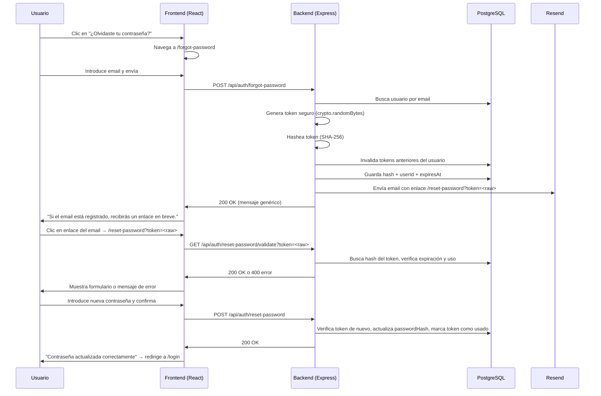

# Design Document: Forgot Password

## Overview

This feature adds a self-service password recovery flow to the Atriax admin panel. It consists of three steps:

1. The user clicks "¿Olvidaste tu contraseña?" on the login page and is taken to a request form.
2. The backend generates a secure, single-use token, stores its hash, and sends a recovery email via Resend.
3. The user clicks the link in the email, the frontend validates the token, and the user sets a new password.

The implementation follows the same patterns already established in the codebase: Drizzle ORM for DB access, bcrypt for hashing, Resend via `mailService.ts` for email, express-rate-limit for abuse protection, and shadcn/ui components for the frontend.

---

## Architecture



---

## Components and Interfaces

### Frontend

**New pages** (in `frontend/src/pages/`):
- `ForgotPasswordPage.tsx` — form with email input and submit button
- `ResetPasswordPage.tsx` — form with new password + confirm password fields; validates token on mount

**Modifications to existing files**:
- `frontend/src/pages/LoginPage.tsx` — add `<Link to="/forgot-password">¿Olvidaste tu contraseña?</Link>` below the password field
- `frontend/src/App.tsx` — add routes for `/forgot-password` and `/reset-password` wrapped in `<PublicRoute>`

**API calls** (via `frontend/src/lib/api.ts`):
```typescript
// Request reset
POST /api/auth/forgot-password
Body: { email: string }
Response: { message: string }

// Validate token (before showing form)
GET /api/auth/reset-password/validate?token=<string>
Response: 200 OK | 400 { error: { message: string } }

// Submit new password
POST /api/auth/reset-password
Body: { token: string; password: string }
Response: { message: string } | 400 { error: { message: string } }
```

### Backend

**New service**: `backend/src/services/passwordResetService.ts`
- `requestPasswordReset(email: string): Promise<void>` — generates token, stores hash, sends email
- `validateResetToken(rawToken: string): Promise<void>` — throws if invalid/expired/used
- `resetPassword(rawToken: string, newPassword: string): Promise<void>` — validates token, updates password hash, marks token used

**Modifications to existing files**:
- `backend/src/routes/auth.ts` — add three new route handlers using the service above
- `backend/src/services/emailTemplates.ts` — add `passwordResetTemplate(resetUrl: string)`
- `backend/src/services/mailService.ts` — add `sendPasswordResetEmail(email: string, resetUrl: string)`
- `backend/src/db/schema.ts` — add `passwordResetTokens` table

**New migration**: `backend/drizzle/0010_forgot_password.sql`

---

## Data Models

### New DB table: `password_reset_tokens`

```typescript
export const passwordResetTokens = pgTable(
  'password_reset_tokens',
  {
    id: uuid('id').primaryKey().default(sql`gen_random_uuid()`),
    userId: uuid('user_id')
      .notNull()
      .references(() => users.id, { onDelete: 'cascade' }),
    tokenHash: text('token_hash').unique().notNull(), // SHA-256 of raw token
    expiresAt: timestamp('expires_at', { withTimezone: true }).notNull(),
    used: boolean('used').notNull().default(false),
    createdAt: timestamp('created_at', { withTimezone: true }).defaultNow(),
  },
  (table) => [
    index('idx_prt_user_id').on(table.userId),
    index('idx_prt_token_hash').on(table.tokenHash),
    index('idx_prt_expires_at').on(table.expiresAt),
  ]
);
```

**Token generation strategy**:
- Raw token: `crypto.randomBytes(32).toString('hex')` — 256 bits of entropy (exceeds 128-bit minimum)
- Stored hash: `crypto.createHash('sha256').update(rawToken).digest('hex')`
- Expiry: `now + 1 hour`
- The raw token is sent in the email URL; only the hash is stored in the DB

**Rate limiting** (for `POST /api/auth/forgot-password`):
- Uses `express-rate-limit` (already a dependency pattern in the project)
- 5 requests per IP per 15 minutes
- Returns HTTP 429 with message "Demasiadas solicitudes. Por favor, inténtalo de nuevo más tarde."

**Timing attack prevention**:
- The `requestPasswordReset` function always performs the same operations (including a bcrypt-equivalent constant-time delay) regardless of whether the email exists, ensuring uniform response time.

---

## Correctness Properties

*A property is a characteristic or behavior that should hold true across all valid executions of a system — essentially, a formal statement about what the system should do. Properties serve as the bridge between human-readable specifications and machine-verifiable correctness guarantees.*


### Property 1: Token generation creates a valid DB record

*For any* registered user email, calling `requestPasswordReset` should result in a new record in `password_reset_tokens` with a `userId` matching the user, an `expiresAt` approximately 1 hour in the future, and `used = false`.

**Validates: Requirements 2.2, 3.1**

### Property 2: Email is sent with token URL on valid request

*For any* registered user email, calling `requestPasswordReset` should trigger a call to the mail service with a URL containing the raw token in the format `<base_url>/reset-password?token=<rawToken>`.

**Validates: Requirements 2.3, 5.2**

### Property 3: Response message is identical for registered and unregistered emails

*For any* two emails — one belonging to a registered user and one not — the response body from `POST /api/auth/forgot-password` should be identical.

**Validates: Requirements 2.4**

### Property 4: Invalid email format is rejected client-side without API call

*For any* string that is not a valid email format (e.g., missing `@`, missing domain), submitting the ForgotPasswordPage form should display a validation error and make zero API calls.

**Validates: Requirements 2.5**

### Property 5: Generated token has sufficient entropy

*For any* token generated by `requestPasswordReset`, the raw token should be at least 32 hex characters long (≥ 128 bits of entropy).

**Validates: Requirements 3.1**

### Property 6: Only the token hash is stored, not the raw token

*For any* call to `requestPasswordReset`, the value stored in `password_reset_tokens.tokenHash` should equal `SHA-256(rawToken)` and should not equal the raw token itself.

**Validates: Requirements 3.2**

### Property 7: New token invalidates all previous pending tokens for the same user

*For any* user, calling `requestPasswordReset` twice should result in the first token being invalidated (marked as used or deleted) before the second token is stored, leaving at most one valid token per user.

**Validates: Requirements 3.3**

### Property 8: Token validation rejects all invalid token states

*For any* token that is expired, already used, or non-existent, calling `validateResetToken` should throw an error with HTTP 400 and the message "El enlace de recuperación no es válido o ha expirado."

**Validates: Requirements 3.4, 3.5, 4.3**

### Property 9: Successful password reset updates password and marks token as used

*For any* valid reset token and new password, calling `resetPassword` should: (1) update the user's `passwordHash` to `bcrypt(newPassword)`, (2) mark the token as `used = true`, and (3) cause a subsequent call to `resetPassword` with the same token to fail.

**Validates: Requirements 3.6, 4.6**

### Property 10: Password shorter than 8 characters is rejected client-side

*For any* password string with fewer than 8 characters, submitting the ResetPasswordPage form should display a validation error and make zero API calls.

**Validates: Requirements 4.4**

### Property 11: Mismatched passwords are rejected client-side

*For any* two password strings that are not equal, submitting the ResetPasswordPage form should display "Las contraseñas no coinciden" and make zero API calls.

**Validates: Requirements 4.5**

### Property 12: Password reset email contains correct subject, URL, and expiry notice

*For any* call to `passwordResetTemplate(resetUrl)`, the resulting email object should have subject `"Recuperación de contraseña - Atriax"`, an HTML body containing the `resetUrl`, and text indicating the link expires in 1 hour.

**Validates: Requirements 5.1, 5.2, 5.3**

### Property 13: Mail service errors are logged without exposing details to the user

*For any* call to `requestPasswordReset` where the mail service throws an error, the error should be logged (via the logger) and the API should still return the generic success response without propagating the error to the client.

**Validates: Requirements 5.4**

### Property 14: Rate limit enforced at 5 requests per IP per 15 minutes

*For any* sequence of more than 5 requests to `POST /api/auth/forgot-password` from the same IP within a 15-minute window, the 6th and subsequent requests should receive HTTP 429 with the message "Demasiadas solicitudes. Por favor, inténtalo de nuevo más tarde."

**Validates: Requirements 6.1, 6.2**

---

## Error Handling

| Scenario | Backend response | Frontend behavior |
|---|---|---|
| Email not found | 200 + generic message | Shows confirmation message |
| Token expired or used | 400 + "El enlace de recuperación no es válido o ha expirado." | Shows error with link to request new one |
| Token missing in URL | — | Frontend redirects to `/forgot-password` |
| Password < 8 chars | — | Client-side validation error, no request |
| Passwords don't match | — | Client-side "Las contraseñas no coinciden", no request |
| Mail service failure | Logs error, returns 200 | Shows confirmation message (user unaware) |
| Rate limit exceeded | 429 + message | Displays server error message |
| DB error during reset | 500 | Shows generic server error message |

All backend errors follow the existing pattern: `{ error: { message: string } }`.

---

## Testing Strategy

### Unit tests

Focus on specific examples, edge cases, and integration points:

- `LoginPage` renders the "¿Olvidaste tu contraseña?" link
- `ForgotPasswordPage` renders email field, submit button, and back link
- `ForgotPasswordPage` shows confirmation message after successful submission
- `ForgotPasswordPage` disables button while request is in flight
- `ResetPasswordPage` redirects to `/forgot-password` when no token in URL
- `ResetPasswordPage` shows error message when token validation fails
- `ResetPasswordPage` shows success message and redirects after successful reset
- `passwordResetTemplate` returns correct subject and body structure
- `POST /api/auth/forgot-password` returns 200 for both registered and unregistered emails
- `POST /api/auth/reset-password` returns 400 for expired token

### Property-based tests

Use **fast-check** (already available in the project via vitest) for backend service tests and frontend validation tests. Each test runs a minimum of 100 iterations.

**Backend** (`backend/src/services/__tests__/passwordResetService.property.test.ts`):

- **Feature: forgot-password, Property 1**: For any registered user, `requestPasswordReset` creates a DB record with correct userId, ~1h expiry, used=false
- **Feature: forgot-password, Property 3**: For any email (registered or not), response body is identical
- **Feature: forgot-password, Property 5**: For any generated token, raw token length >= 64 hex chars
- **Feature: forgot-password, Property 6**: For any generated token, stored hash equals SHA-256(rawToken) and differs from rawToken
- **Feature: forgot-password, Property 7**: For any user, two consecutive calls leave only one valid token
- **Feature: forgot-password, Property 8**: For any expired/used/nonexistent token, validateResetToken throws 400
- **Feature: forgot-password, Property 9**: For any valid token + new password, resetPassword updates hash and marks token used

**Email template** (`backend/src/services/__tests__/emailTemplates.property.test.ts`):

- **Feature: forgot-password, Property 12**: For any reset URL string, `passwordResetTemplate` returns correct subject, contains the URL, and mentions "1 hora"

**Frontend validation** (`frontend/src/pages/__tests__/ForgotPasswordPage.property.test.tsx` and `ResetPasswordPage.property.test.tsx`):

- **Feature: forgot-password, Property 4**: For any non-email string, form shows validation error without API call
- **Feature: forgot-password, Property 10**: For any string with length < 8, form shows validation error without API call
- **Feature: forgot-password, Property 11**: For any two distinct strings, form shows "Las contraseñas no coinciden" without API call

**Rate limiting** (`backend/src/routes/__tests__/auth.ratelimit.test.ts`):

- **Feature: forgot-password, Property 14**: 6th request from same IP within 15 min returns 429
