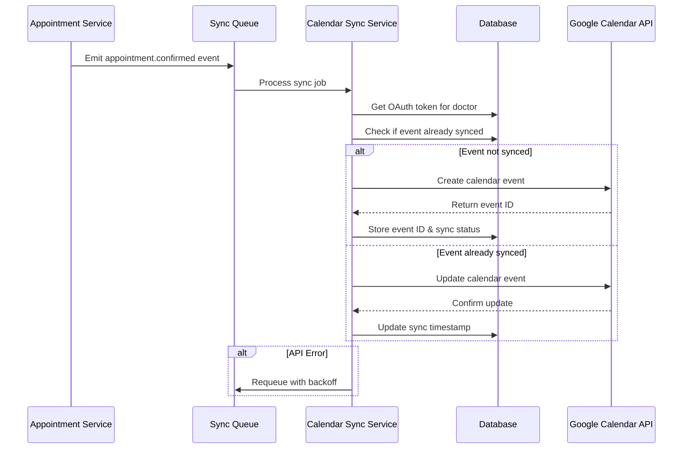

# Design Document: Google Calendar Sync

## Overview

This feature enables automatic synchronization of confirmed appointments from the application to doctors' Google Calendar accounts. The system uses OAuth 2.0 for secure authentication and the Google Calendar API v3 for calendar operations. The design follows an event-driven architecture where appointment lifecycle events (create, update, delete, status changes) trigger synchronization operations.

The sync service operates asynchronously with retry logic and rate limiting to ensure reliability. Only confirmed appointments are synced to Google Calendar, and the system maintains bidirectional tracking between internal appointments and Google Calendar events.

### Key Design Goals

- Secure OAuth 2.0 authentication with automatic token refresh
- Event-driven synchronization triggered by appointment changes
- Reliable operation with retry logic and exponential backoff
- Rate limiting to respect Google Calendar API quotas
- Privacy-compliant event formatting (HIPAA considerations)
- Transparent sync status tracking for doctors

## Architecture

### High-Level Architecture

```mermaid
graph TB
    subgraph "Frontend"
        UI[Doctor UI]
        OAuth[OAuth Flow Component]
    end
    
    subgraph "Backend API"
        AuthRoute[/auth/google/calendar]
        SyncRoute[/calendar/sync]
        AppRoute[/appointments]
    end
    
    subgraph "Services"
        GoogleAuthService[Google Auth Service]
        CalendarSyncService[Calendar Sync Service]
        AppointmentService[Appointment Service]
    end
    
    subgraph "Infrastructure"
        Queue[Sync Queue]
        DB[(PostgreSQL)]
        Cache[Token Cache]
    end
    
    subgraph "External"
        GoogleOAuth[Google OAuth 2.0]
        GoogleCalendar[Google Calendar API v3]
    end
    
    UI -->|Initiate OAuth| AuthRoute
    UI -->|Manual Sync| SyncRoute
    UI -->|CRUD Operations| AppRoute
    
    AuthRoute --> GoogleAuthService
    SyncRoute --> CalendarSyncService
    AppRoute --> AppointmentService
    
    GoogleAuthService -->|Store Tokens| DB
    GoogleAuthService -->|Cache Tokens| Cache
    GoogleAuthService <-->|OAuth Flow| GoogleOAuth
    
    AppointmentService -->|Emit Events| Queue
    CalendarSyncService -->|Consume Events| Queue
    CalendarSyncService -->|Read/Write| DB
    CalendarSyncService <-->|API Calls| GoogleCalendar
    
    CalendarSyncService -->|Refresh Tokens| GoogleAuthService
```

### Sync Flow



## Components and Interfaces

### 1. Google Auth Service

Handles OAuth 2.0 authentication flow and token management.

**Responsibilities:**
- Initiate OAuth flow and handle callback
- Store and retrieve OAuth tokens securely
- Automatically refresh expired tokens
- Revoke tokens on disconnect

**Interface:**

```typescript
interface GoogleAuthService {
  // Generate OAuth authorization URL
  getAuthorizationUrl(userId: string, tenantId: string): Promise<string>;
  
  // Handle OAuth callback and store tokens
  handleCallback(code: string, state: string): Promise<{
    userId: string;
    tenantId: string;
  }>;
  
  // Get valid access token (refreshes if needed)
  getAccessToken(userId: string, tenantId: string): Promise<string | null>;
  
  // Revoke token and disconnect
  disconnect(userId: string, tenantId: string): Promise<void>;
  
  // Check if user has connected calendar
  isConnected(userId: string, tenantId: string): Promise<boolean>;
}
```

### 2. Calendar Sync Service

Core service responsible for synchronizing appointments to Google Calendar.

**Responsibilities:**
- Create, update, and delete calendar events
- Implement retry logic with exponential backoff
- Handle rate limiting
- Track sync status
- Process sync queue

**Interface:**

```typescript
interface CalendarSyncService {
  // Sync a single appointment
  syncAppointment(appointmentId: string, tenantId: string): Promise<SyncResult>;
  
  // Sync all confirmed appointments for a doctor (initial sync)
  syncAllAppointments(userId: string, tenantId: string): Promise<BatchSyncResult>;
  
  // Delete calendar event for appointment
  deleteCalendarEvent(appointmentId: string, tenantId: string): Promise<void>;
  
  // Retry failed sync operations
  retryFailedSync(appointmentId: string, tenantId: string): Promise<SyncResult>;
  
  // Get sync status for appointment
  getSyncStatus(appointmentId: string, tenantId: string): Promise<SyncStatus>;
}

interface SyncResult {
  success: boolean;
  eventId?: string;
  error?: string;
  retryCount: number;
}

interface BatchSyncResult {
  total: number;
  synced: number;
  failed: number;
  errors: Array<{ appointmentId: string; error: string }>;
}

interface SyncStatus {
  status: 'unsynced' | 'pending' | 'synced' | 'failed';
  lastSyncedAt?: Date;
  eventId?: string;
  error?: string;
  retryCount: number;
}
```

### 3. Event Formatter

Formats appointment data into Google Calendar event structure.

**Responsibilities:**
- Transform appointment data to calendar event format
- Include appropriate patient information (privacy-compliant)
- Generate event descriptions with links back to the app
- Handle timezone conversions

**Interface:**

```typescript
interface EventFormatter {
  // Format appointment as calendar event
  formatEvent(appointment: AppointmentDetail, patient: Patient): CalendarEvent;
  
  // Format event update (partial data)
  formatEventUpdate(
    appointment: Partial<AppointmentDetail>,
    patient?: Patient
  ): Partial<CalendarEvent>;
}

interface CalendarEvent {
  summary: string;
  description: string;
  start: {
    dateTime: string;
    timeZone: string;
  };
  end: {
    dateTime: string;
    timeZone: string;
  };
  extendedProperties?: {
    private: {
      appointmentId: string;
      tenantId: string;
    };
  };
}
```

### 4. Sync Queue

Manages asynchronous sync operations with retry logic.

**Responsibilities:**
- Queue sync operations
- Implement exponential backoff
- Prioritize operations
- Handle rate limiting

**Interface:**

```typescript
interface SyncQueue {
  // Add sync job to queue
  enqueue(job: SyncJob): Promise<void>;
  
  // Process next job
  processNext(): Promise<void>;
  
  // Retry failed job with backoff
  retry(job: SyncJob, error: Error): Promise<void>;
  
  // Get queue status
  getStatus(): Promise<QueueStatus>;
}

interface SyncJob {
  id: string;
  type: 'create' | 'update' | 'delete' | 'batch';
  appointmentId?: string;
  userId: string;
  tenantId: string;
  retryCount: number;
  scheduledFor: Date;
  priority: number;
}

interface QueueStatus {
  pending: number;
  processing: number;
  failed: number;
}
```

### 5. Rate Limiter

Ensures compliance with Google Calendar API rate limits.

**Responsibilities:**
- Track API usage per user
- Implement token bucket algorithm
- Queue requests when approaching limits
- Handle 429 responses

**Interface:**

```typescript
interface RateLimiter {
  // Check if request can proceed
  canProceed(userId: string): Promise<boolean>;
  
  // Record API call
  recordCall(userId: string): Promise<void>;
  
  // Wait for rate limit window
  waitForCapacity(userId: string): Promise<void>;
  
  // Get current usage
  getUsage(userId: string): Promise<RateLimitUsage>;
}

interface RateLimitUsage {
  current: number;
  limit: number;
  resetAt: Date;
}
```

## Data Models

### Database Schema Changes

#### New Table: google_calendar_tokens

Stores OAuth tokens for Google Calendar integration.

```typescript
export const googleCalendarTokens = pgTable(
  'google_calendar_tokens',
  {
    id: uuid('id')
      .primaryKey()
      .default(sql`gen_random_uuid()`),
    userId: uuid('user_id')
      .notNull()
      .references(() => users.id, { onDelete: 'cascade' }),
    tenantId: uuid('tenant_id')
      .notNull()
      .references(() => tenants.id, { onDelete: 'cascade' }),
    accessToken: text('access_token').notNull(), // Encrypted at rest
    refreshToken: text('refresh_token').notNull(), // Encrypted at rest
    tokenType: text('token_type').notNull().default('Bearer'),
    expiresAt: timestamp('expires_at', { withTimezone: true }).notNull(),
    scope: text('scope').notNull(),
    createdAt: timestamp('created_at', { withTimezone: true }).defaultNow(),
    updatedAt: timestamp('updated_at', { withTimezone: true }).defaultNow(),
  },
  (table) => [
    index('idx_google_calendar_tokens_user').on(table.userId),
    index('idx_google_calendar_tokens_tenant').on(table.tenantId),
  ]
);
```

#### New Table: calendar_sync_status

Tracks synchronization status for each appointment.

```typescript
export const calendarSyncStatus = pgTable(
  'calendar_sync_status',
  {
    id: uuid('id')
      .primaryKey()
      .default(sql`gen_random_uuid()`),
    appointmentId: uuid('appointment_id')
      .notNull()
      .references(() => appointments.id, { onDelete: 'cascade' })
      .unique(),
    tenantId: uuid('tenant_id')
      .notNull()
      .references(() => tenants.id, { onDelete: 'cascade' }),
    googleEventId: text('google_event_id'),
    status: text('status', {
      enum: ['unsynced', 'pending', 'synced', 'failed'],
    })
      .notNull()
      .default('unsynced'),
    lastSyncedAt: timestamp('last_synced_at', { withTimezone: true }),
    lastError: text('last_error'),
    retryCount: integer('retry_count').notNull().default(0),
    createdAt: timestamp('created_at', { withTimezone: true }).defaultNow(),
    updatedAt: timestamp('updated_at', { withTimezone: true }).defaultNow(),
  },
  (table) => [
    index('idx_calendar_sync_status_appointment').on(table.appointmentId),
    index('idx_calendar_sync_status_tenant').on(table.tenantId),
    index('idx_calendar_sync_status_status').on(table.status),
  ]
);
```

#### New Table: calendar_sync_queue

Manages async sync operations.

```typescript
export const calendarSyncQueue = pgTable(
  'calendar_sync_queue',
  {
    id: uuid('id')
      .primaryKey()
      .default(sql`gen_random_uuid()`),
    jobType: text('job_type', {
      enum: ['create', 'update', 'delete', 'batch'],
    }).notNull(),
    appointmentId: uuid('appointment_id').references(() => appointments.id, {
      onDelete: 'cascade',
    }),
    userId: uuid('user_id')
      .notNull()
      .references(() => users.id, { onDelete: 'cascade' }),
    tenantId: uuid('tenant_id')
      .notNull()
      .references(() => tenants.id, { onDelete: 'cascade' }),
    payload: jsonb('payload'),
    status: text('status', {
      enum: ['pending', 'processing', 'completed', 'failed'],
    })
      .notNull()
      .default('pending'),
    retryCount: integer('retry_count').notNull().default(0),
    scheduledFor: timestamp('scheduled_for', { withTimezone: true })
      .notNull()
      .defaultNow(),
    processedAt: timestamp('processed_at', { withTimezone: true }),
    error: text('error'),
    priority: integer('priority').notNull().default(0),
    createdAt: timestamp('created_at', { withTimezone: true }).defaultNow(),
    updatedAt: timestamp('updated_at', { withTimezone: true }).defaultNow(),
  },
  (table) => [
    index('idx_calendar_sync_queue_status').on(table.status),
    index('idx_calendar_sync_queue_scheduled').on(table.scheduledFor),
    index('idx_calendar_sync_queue_user').on(table.userId),
  ]
);
```

### API Endpoints

#### OAuth Endpoints

```typescript
// Initiate OAuth flow
GET /api/auth/google/calendar
Response: { authUrl: string }

// OAuth callback
GET /api/auth/google/calendar/callback?code=...&state=...
Response: { success: boolean, message: string }

// Check connection status
GET /api/calendar/status
Response: { 
  connected: boolean, 
  connectedAt?: string,
  lastSyncAt?: string 
}

// Disconnect calendar
DELETE /api/calendar/disconnect
Response: { success: boolean, message: string }
```

#### Sync Endpoints

```typescript
// Manual sync single appointment
POST /api/calendar/sync/:appointmentId
Response: { 
  success: boolean, 
  eventId?: string,
  error?: string 
}

// Initial sync all appointments
POST /api/calendar/sync/all
Response: { 
  total: number,
  synced: number,
  failed: number,
  errors: Array<{ appointmentId: string, error: string }>
}

// Get sync status for appointment
GET /api/calendar/sync/:appointmentId/status
Response: {
  status: 'unsynced' | 'pending' | 'synced' | 'failed',
  lastSyncedAt?: string,
  eventId?: string,
  error?: string
}

// Retry failed sync
POST /api/calendar/sync/:appointmentId/retry
Response: { 
  success: boolean, 
  eventId?: string,
  error?: string 
}
```

### Configuration

```typescript
interface GoogleCalendarConfig {
  oauth: {
    clientId: string;
    clientSecret: string;
    redirectUri: string;
    scopes: string[];
  };
  api: {
    baseUrl: string;
    version: string;
    timeout: number;
  };
  sync: {
    maxRetries: number;
    retryDelayMs: number;
    backoffMultiplier: number;
    batchSize: number;
    queueProcessInterval: number;
  };
  rateLimit: {
    requestsPerMinute: number;
    requestsPerDay: number;
  };
}
```


## Correctness Properties

*A property is a characteristic or behavior that should hold true across all valid executions of a system—essentially, a formal statement about what the system should do. Properties serve as the bridge between human-readable specifications and machine-verifiable correctness guarantees.*

### Property 1: OAuth Token Secure Storage

*For any* doctor completing OAuth authentication, the stored OAuth token must be encrypted at rest in the database.

**Validates: Requirements 1.2, 7.1**

### Property 2: Automatic Token Refresh

*For any* expired OAuth token, when accessed by the sync service, the system must automatically refresh the token and return a valid access token.

**Validates: Requirements 1.3**

### Property 3: Token Refresh Failure Notification

*For any* OAuth token refresh failure, the system must notify the doctor to re-authenticate.

**Validates: Requirements 1.4**

### Property 4: Confirmed Appointment Sync

*For any* appointment that changes status to "confirmed", the sync service must create a corresponding calendar event in Google Calendar.

**Validates: Requirements 2.1, 4.3**

### Property 5: Calendar Event Required Fields

*For any* calendar event created from an appointment, the event must include appointment date, time, duration, patient name, appointment type, patient contact information, appointment notes, and a link back to the appointment system.

**Validates: Requirements 2.2, 6.1, 6.2, 6.5**

### Property 6: Calendar Event Time Accuracy

*For any* calendar event created from an appointment, the event start time and duration must exactly match the appointment's scheduled time and duration.

**Validates: Requirements 6.3, 6.4**

### Property 7: Confirmed Appointment Update Sync

*For any* confirmed appointment that is updated, the sync service must update the corresponding calendar event with the new information.

**Validates: Requirements 2.3**

### Property 8: Event ID Storage

*For any* successfully synced appointment, the Google Calendar event ID must be stored in the calendar_sync_status table.

**Validates: Requirements 2.4**

### Property 9: Canceled Appointment Deletion

*For any* appointment that changes status to "canceled" or is deleted, the sync service must delete the corresponding calendar event from Google Calendar.

**Validates: Requirements 3.1, 3.3, 4.2**

### Property 10: Graceful Missing Event Handling

*For any* attempt to delete a calendar event that doesn't exist in Google Calendar, the system must mark the appointment as unsynced without throwing an error.

**Validates: Requirements 3.2**

### Property 11: Non-Confirmed Appointment Exclusion

*For any* appointment with status other than "confirmed", the sync service must not create a calendar event.

**Validates: Requirements 4.1**

### Property 12: Sync Failure Retry with Exponential Backoff

*For any* failed synchronization operation, the sync service must retry with exponentially increasing delays between attempts.

**Validates: Requirements 2.5, 3.4, 5.1, 5.2**

### Property 13: Maximum Retry Limit

*For any* synchronization operation, the system must limit retry attempts to exactly 5 attempts, after which it marks the sync status as "failed".

**Validates: Requirements 5.3, 5.4**

### Property 14: Privacy-Compliant Event Content

*For any* calendar event created from an appointment, the event must not include sensitive medical information beyond the appointment type.

**Validates: Requirements 7.3**

### Property 15: Token Revocation on Disconnect

*For any* doctor disconnecting Google Calendar, the system must revoke the OAuth token with Google and remove it from the database.

**Validates: Requirements 7.4, 10.3**

### Property 16: Sync Status Update on Success

*For any* successful synchronization operation, the system must update the sync status to "synced" and record the timestamp.

**Validates: Requirements 8.2**

### Property 17: Initial Sync All Confirmed Appointments

*For any* doctor completing OAuth authentication for the first time, the sync service must sync all existing confirmed appointments for that doctor.

**Validates: Requirements 9.1**

### Property 18: Batch Processing for Initial Sync

*For any* initial sync operation with more than 10 appointments, the sync service must process appointments in batches to avoid rate limits.

**Validates: Requirements 9.2**

### Property 19: Initial Sync Resumption

*For any* interrupted initial sync operation, when resumed, the sync service must continue from the last successfully synced appointment without re-syncing already completed appointments.

**Validates: Requirements 9.4**

### Property 20: Disconnect Cleanup

*For any* doctor disconnecting Google Calendar, the system must delete all calendar events created by the appointment system, remove the OAuth token, and reset all sync statuses to "unsynced".

**Validates: Requirements 10.2, 10.4**

### Property 21: Rate Limit Queueing

*For any* synchronization operation when approaching rate limits, the sync service must queue the operation for delayed execution rather than failing immediately.

**Validates: Requirements 11.2**

### Property 22: HTTP 429 Handling

*For any* HTTP 429 (Too Many Requests) response from Google Calendar API, the sync service must retry the operation with exponential backoff.

**Validates: Requirements 11.3**

### Property 23: Operation Priority

*For any* rate-limited scenario, real-time synchronization operations (create, update, delete) must have higher priority than batch operations in the queue.

**Validates: Requirements 11.4**

### Property 24: Comprehensive Operation Logging

*For any* synchronization operation (success or failure), the system must log the operation with timestamp, outcome, and error details if applicable.

**Validates: Requirements 12.1, 12.2**

### Property 25: Token Refresh Logging

*For any* OAuth token refresh event, the system must log the refresh operation with timestamp and outcome.

**Validates: Requirements 12.3**

### Property 26: High Failure Rate Alerting

*For any* time window where the sync failure rate exceeds 5%, the system must trigger an administrator alert.

**Validates: Requirements 12.5**

## Error Handling

### Error Categories

1. **Authentication Errors**
   - Invalid or expired OAuth tokens
   - Token refresh failures
   - Insufficient permissions

2. **API Errors**
   - Network timeouts
   - HTTP 429 (rate limiting)
   - HTTP 404 (event not found)
   - HTTP 500 (server errors)
   - Invalid request format

3. **Data Errors**
   - Missing required appointment data
   - Invalid date/time formats
   - Appointment not found
   - User not connected to Google Calendar

4. **Queue Errors**
   - Queue processing failures
   - Job serialization errors
   - Deadlocks or race conditions

### Error Handling Strategies

#### Authentication Errors

```typescript
// Token expired or invalid
if (error.code === 401) {
  // Attempt automatic refresh
  const refreshed = await googleAuthService.refreshToken(userId, tenantId);
  
  if (refreshed) {
    // Retry operation with new token
    return await retryOperation();
  } else {
    // Mark as failed, notify user to re-authenticate
    await notifyReauthenticationRequired(userId);
    throw new AuthenticationError('Token refresh failed');
  }
}
```

#### API Rate Limiting

```typescript
// HTTP 429 response
if (error.code === 429) {
  const retryAfter = error.headers['retry-after'] || calculateBackoff(retryCount);
  
  // Queue for retry with appropriate delay
  await syncQueue.enqueue({
    ...job,
    retryCount: retryCount + 1,
    scheduledFor: new Date(Date.now() + retryAfter * 1000),
  });
  
  // Log rate limit event
  logger.warn('Rate limit hit', { userId, retryAfter });
}
```

#### Network Errors

```typescript
// Timeout or connection errors
if (error.code === 'ETIMEDOUT' || error.code === 'ECONNREFUSED') {
  if (retryCount < MAX_RETRIES) {
    // Exponential backoff
    const delay = INITIAL_DELAY * Math.pow(BACKOFF_MULTIPLIER, retryCount);
    
    await syncQueue.retry(job, delay);
  } else {
    // Max retries exhausted
    await updateSyncStatus(appointmentId, {
      status: 'failed',
      lastError: error.message,
      retryCount,
    });
    
    logger.error('Sync failed after max retries', { appointmentId, error });
  }
}
```

#### Data Validation Errors

```typescript
// Invalid appointment data
if (!appointment.scheduledAt || !appointment.patientId) {
  // Don't retry - data issue needs manual intervention
  await updateSyncStatus(appointmentId, {
    status: 'failed',
    lastError: 'Invalid appointment data',
    retryCount: 0,
  });
  
  logger.error('Invalid appointment data', { appointmentId });
  throw new ValidationError('Missing required appointment fields');
}
```

#### Event Not Found (404)

```typescript
// Calendar event doesn't exist
if (error.code === 404 && operation === 'delete') {
  // Gracefully handle - event already gone
  await updateSyncStatus(appointmentId, {
    status: 'unsynced',
    googleEventId: null,
  });
  
  logger.info('Event not found, marked as unsynced', { appointmentId });
  return { success: true };
}
```

### Error Recovery

1. **Automatic Recovery**: Token refresh, exponential backoff retries
2. **Manual Recovery**: User re-authentication, manual retry button
3. **Administrative Recovery**: Queue cleanup, bulk retry operations

### Monitoring and Alerting

- Track error rates by category
- Alert on sustained high error rates (>5%)
- Alert on authentication failures requiring user action
- Dashboard showing sync health metrics

## Testing Strategy

### Unit Testing

Unit tests will focus on specific examples, edge cases, and error conditions for individual components:

**Google Auth Service**
- OAuth URL generation with correct parameters
- Token storage and retrieval
- Token encryption/decryption
- Refresh token flow with mock Google API
- Error handling for invalid tokens

**Calendar Sync Service**
- Event creation with specific appointment data
- Event update with partial data
- Event deletion
- Error handling for API failures
- Sync status updates

**Event Formatter**
- Event formatting with complete appointment data
- Event formatting with minimal data
- Privacy compliance (no sensitive data)
- Timezone conversion edge cases
- Link generation

**Rate Limiter**
- Token bucket algorithm implementation
- Capacity checking
- Usage tracking
- Reset timing

**Sync Queue**
- Job enqueueing
- Priority ordering
- Retry scheduling
- Exponential backoff calculation

### Property-Based Testing

Property-based tests will verify universal properties across all inputs using the fast-check library (already in dependencies). Each test will run a minimum of 100 iterations.

**Configuration**: Each property test must include a comment tag referencing the design property:
```typescript
// Feature: google-calendar-sync, Property 1: OAuth Token Secure Storage
```

**Test Categories**:

1. **Authentication Properties**
   - Property 1: Token encryption round-trip
   - Property 2: Token refresh for any expired token
   - Property 3: Notification on any refresh failure

2. **Sync Operation Properties**
   - Property 4: Event creation for any confirmed appointment
   - Property 5: Required fields present in any event
   - Property 6: Time accuracy for any appointment
   - Property 7: Event update for any confirmed appointment change
   - Property 8: Event ID storage for any successful sync
   - Property 9: Event deletion for any canceled/deleted appointment
   - Property 10: Graceful handling of any missing event
   - Property 11: No events for any non-confirmed appointment

3. **Reliability Properties**
   - Property 12: Exponential backoff for any failure
   - Property 13: Max 5 retries for any operation
   - Property 19: Resumption from any interruption point

4. **Privacy Properties**
   - Property 14: No sensitive data in any event

5. **Batch Operation Properties**
   - Property 17: All confirmed appointments synced on initial sync
   - Property 18: Batching for any large appointment set
   - Property 20: Complete cleanup on any disconnect

6. **Rate Limiting Properties**
   - Property 21: Queueing when approaching any rate limit
   - Property 22: Backoff for any 429 response
   - Property 23: Priority ordering for any mixed operations

7. **Observability Properties**
   - Property 24: Logging for any operation
   - Property 25: Logging for any token refresh
   - Property 26: Alerting for any high failure rate

**Example Property Test**:

```typescript
import fc from 'fast-check';

// Feature: google-calendar-sync, Property 4: Confirmed Appointment Sync
describe('Calendar Sync Properties', () => {
  it('creates calendar event for any appointment changing to confirmed', async () => {
    await fc.assert(
      fc.asyncProperty(
        appointmentArbitrary(),
        async (appointment) => {
          // Arrange: appointment with non-confirmed status
          const created = await createAppointment({
            ...appointment,
            status: 'pending',
          });
          
          // Act: change status to confirmed
          await updateAppointment(created.id, { status: 'confirmed' });
          
          // Assert: calendar event exists
          const syncStatus = await getSyncStatus(created.id);
          expect(syncStatus.status).toBe('synced');
          expect(syncStatus.googleEventId).toBeDefined();
          
          // Verify event in Google Calendar
          const event = await mockGoogleCalendar.getEvent(
            syncStatus.googleEventId
          );
          expect(event).toBeDefined();
        }
      ),
      { numRuns: 100 }
    );
  });
});
```

### Integration Testing

Integration tests will verify end-to-end flows:

- Complete OAuth flow from initiation to token storage
- Appointment lifecycle with calendar sync (create → confirm → update → cancel)
- Initial sync of multiple appointments
- Disconnect and cleanup flow
- Rate limiting behavior with high load
- Queue processing with failures and retries

### Test Data Generators

Property-based tests will use custom arbitraries for domain objects:

```typescript
// Appointment arbitrary
const appointmentArbitrary = () =>
  fc.record({
    patientId: fc.uuid(),
    scheduledAt: fc.date({ min: new Date() }),
    durationMinutes: fc.integer({ min: 15, max: 240 }),
    status: fc.constantFrom('pending', 'confirmed', 'completed', 'cancelled'),
    notes: fc.option(fc.string(), { nil: null }),
  });

// Patient arbitrary
const patientArbitrary = () =>
  fc.record({
    firstName: fc.string({ minLength: 1, maxLength: 50 }),
    lastName: fc.string({ minLength: 1, maxLength: 50 }),
    email: fc.emailAddress(),
    phone: fc.option(fc.string(), { nil: null }),
  });

// OAuth token arbitrary
const oauthTokenArbitrary = () =>
  fc.record({
    accessToken: fc.string({ minLength: 20 }),
    refreshToken: fc.string({ minLength: 20 }),
    expiresAt: fc.date(),
    scope: fc.constant('https://www.googleapis.com/auth/calendar.events'),
  });
```

### Testing Tools

- **Unit Tests**: Jest (already configured)
- **Property Tests**: fast-check (already in dependencies)
- **API Mocking**: Mock Google Calendar API responses
- **Database**: In-memory PostgreSQL for tests
- **Coverage Target**: 80% code coverage minimum

### Test Execution

```bash
# Run all tests
npm test

# Run property tests only
npm test -- --testNamePattern="Property"

# Run with coverage
npm test -- --coverage

# Run specific test suite
npm test -- calendar-sync
```

