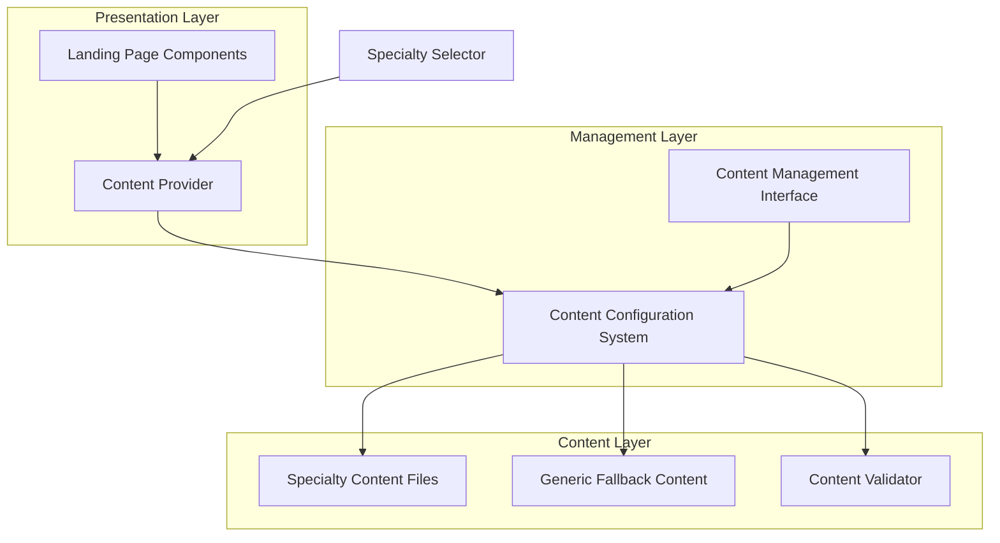

# Design Document: Landing Page Generalization

## Overview

The landing page generalization feature transforms the current aesthetic clinic-specific landing page into a flexible, configurable system that can adapt to any medical specialty. This design maintains backward compatibility while introducing a content configuration system that allows dynamic content replacement based on medical specialty selection.

The current implementation contains hardcoded Spanish text specifically targeting aesthetic medicine practices ("clínica estética", "medicina estética"). The new system will externalize this content into configuration files and introduce a content management layer that supports multiple medical specialties with appropriate fallback mechanisms.

### Key Design Principles

1. **Configuration-Driven Content**: All specialty-specific content is externalized to configuration files
2. **Backward Compatibility**: Existing aesthetic clinic functionality remains unchanged
3. **Graceful Degradation**: System falls back to generic medical content when specialty content is unavailable
4. **Component Isolation**: Landing page components remain structurally unchanged, only content sources change
5. **Type Safety**: Strong TypeScript interfaces ensure content structure consistency

## Architecture

### High-Level Architecture



### Component Architecture

The system introduces three new architectural layers:

1. **Content Provider Layer**: React context and hooks for content delivery
2. **Configuration Management Layer**: Content loading, validation, and caching
3. **Content Storage Layer**: JSON/YAML files with specialty-specific content

### Data Flow

1. User visits landing page with optional specialty parameter
2. Content Provider determines active specialty (default: aesthetic medicine)
3. Configuration Manager loads specialty content with fallback chain
4. Landing page components receive content through React context
5. Components render using provided content instead of hardcoded strings

## Components and Interfaces

### Content Configuration Interface

```typescript
interface SpecialtyContent {
  specialty: string;
  language: string;
  hero: HeroContent;
  problems: ProblemContent[];
  benefits: BenefitContent[];
  features: FeatureContent[];
  howItWorks: HowItWorksContent;
  testimonials: TestimonialContent[];
  faq: FAQContent[];
  cta: CTAContent;
  metadata: ContentMetadata;
}

interface HeroContent {
  headline: string;
  description: string;
  primaryCTA: string;
  secondaryCTA: string;
  trustIndicators: TrustIndicator[];
}

interface ProblemContent {
  icon: string;
  title: string;
  description: string;
}

interface BenefitContent {
  icon: string;
  title: string;
  description: string;
  bullets: string[];
}
```

### Content Provider Component

```typescript
interface ContentProviderProps {
  specialty?: string;
  children: React.ReactNode;
}

interface ContentContextValue {
  content: SpecialtyContent;
  specialty: string;
  isLoading: boolean;
  error: string | null;
}
```

### Configuration Manager

```typescript
class ContentConfigurationManager {
  private cache: Map<string, SpecialtyContent>;
  private validator: ContentValidator;
  
  async loadSpecialtyContent(specialty: string): Promise<SpecialtyContent>;
  validateContent(content: SpecialtyContent): ValidationResult;
  getAvailableSpecialties(): string[];
  getFallbackContent(): SpecialtyContent;
}
```

### Updated Landing Page Components

Each existing component will be modified to accept content through props or context:

```typescript
// Before
export function HeroSection() {
  return (
    <h1>Gestiona tu clínica estética con claridad total</h1>
  );
}

// After
export function HeroSection() {
  const { content } = useContent();
  return (
    <h1>{content.hero.headline}</h1>
  );
}
```

## Data Models

### Content Configuration Schema

```json
{
  "specialty": "aesthetic-medicine",
  "language": "es",
  "hero": {
    "headline": "Gestiona tu clínica estética con claridad total",
    "description": "La plataforma integral para profesionales de medicina estética...",
    "primaryCTA": "Comenzar prueba gratis",
    "secondaryCTA": "Agendar una demo",
    "trustIndicators": [
      {
        "icon": "shield",
        "text": "Datos seguros"
      },
      {
        "icon": "clock", 
        "text": "99.9% uptime"
      },
      {
        "icon": "sparkles",
        "text": "Diseñado para estética"
      }
    ]
  },
  "problems": [
    {
      "icon": "calendar",
      "title": "Conflictos de agenda",
      "description": "Citas duplicadas, solapamientos y confusión entre proveedores y salas."
    }
  ],
  "benefits": [
    {
      "icon": "calendar",
      "title": "Un calendario para toda la clínica",
      "description": "Visualiza la disponibilidad de todos tus proveedores...",
      "bullets": [
        "Vista unificada multi-proveedor",
        "Gestión de salas y equipos",
        "Recordatorios automáticos"
      ]
    }
  ]
}
```

### Content File Structure

```
content/
├── specialties/
│   ├── aesthetic-medicine/
│   │   ├── es.json
│   │   └── en.json
│   ├── cardiology/
│   │   ├── es.json
│   │   └── en.json
│   └── dermatology/
│       ├── es.json
│       └── en.json
├── generic/
│   ├── es.json
│   └── en.json
└── schema/
    └── content-schema.json
```

### Content Validation Schema

The system uses JSON Schema for content validation:

```json
{
  "$schema": "http://json-schema.org/draft-07/schema#",
  "type": "object",
  "required": ["specialty", "language", "hero", "problems", "benefits"],
  "properties": {
    "specialty": {
      "type": "string",
      "pattern": "^[a-z-]+$"
    },
    "hero": {
      "type": "object",
      "required": ["headline", "description", "primaryCTA"],
      "properties": {
        "headline": {
          "type": "string",
          "maxLength": 100
        }
      }
    }
  }
}
```
## Implementation Strategy

### Phase 1: Content Externalization

1. **Extract Current Content**: Move all hardcoded Spanish text from components to aesthetic-medicine content files
2. **Create Content Interfaces**: Define TypeScript interfaces for all content types
3. **Implement Content Provider**: Create React context for content delivery
4. **Update Components**: Modify existing components to use content from context

### Phase 2: Configuration System

1. **Content Manager**: Implement content loading and caching system
2. **Validation System**: Add JSON schema validation for content files
3. **Fallback Logic**: Implement graceful degradation to generic content
4. **Error Handling**: Add comprehensive error handling for missing/invalid content

### Phase 3: Multi-Specialty Support

1. **Generic Content**: Create generic medical practice content as fallback
2. **Additional Specialties**: Add content for 2-3 additional medical specialties
3. **Specialty Selection**: Implement specialty detection/selection mechanism
4. **Testing**: Comprehensive testing across all specialties

### Phase 4: Content Management

1. **Content Validation**: Runtime validation and error reporting
2. **Hot Reloading**: Development-time content updates without restart
3. **Content Versioning**: Basic versioning support for content rollback
4. **Documentation**: Content management documentation and examples

### Migration Strategy

The migration maintains 100% backward compatibility:

1. **Default Behavior**: Without configuration, system defaults to aesthetic medicine content
2. **Gradual Migration**: Components can be migrated one at a time
3. **Content Preservation**: All existing Spanish content is preserved exactly
4. **API Compatibility**: No changes to component props or external APIs

### Content Loading Strategy

```typescript
// Content loading priority:
// 1. Specialty-specific content (e.g., cardiology/es.json)
// 2. Generic medical content (generic/es.json)  
// 3. Hardcoded fallback content (aesthetic medicine)

class ContentLoader {
  async loadContent(specialty: string, language: string): Promise<SpecialtyContent> {
    try {
      // Try specialty-specific content
      return await this.loadSpecialtyContent(specialty, language);
    } catch (error) {
      try {
        // Fall back to generic content
        return await this.loadGenericContent(language);
      } catch (error) {
        // Final fallback to hardcoded content
        return this.getHardcodedFallback();
      }
    }
  }
}
```

### Performance Considerations

1. **Content Caching**: In-memory caching of loaded content files
2. **Lazy Loading**: Content loaded only when needed
3. **Bundle Optimization**: Content files excluded from main bundle
4. **CDN Support**: Content files can be served from CDN

### Security Considerations

1. **Content Validation**: All content validated against schema before use
2. **XSS Prevention**: Content sanitization for user-generated content
3. **Access Control**: Content management restricted to authorized users
4. **Audit Trail**: Changes to content files logged for compliance

## Error Handling

### Error Scenarios and Responses

1. **Missing Content File**: Fall back to generic content, log warning
2. **Invalid Content Structure**: Use fallback content, display admin error
3. **Network Failure**: Use cached content, retry in background
4. **Validation Failure**: Use previous valid content, alert administrators

### Error Recovery Strategy

```typescript
interface ErrorRecoveryStrategy {
  onContentLoadError(error: ContentError): SpecialtyContent;
  onValidationError(content: any, errors: ValidationError[]): SpecialtyContent;
  onNetworkError(specialty: string): SpecialtyContent;
}

class GracefulErrorRecovery implements ErrorRecoveryStrategy {
  onContentLoadError(error: ContentError): SpecialtyContent {
    // Log error for monitoring
    this.logger.warn('Content load failed', { error, specialty: error.specialty });
    
    // Return cached content or fallback
    return this.cache.get('fallback') || this.getHardcodedFallback();
  }
}
```

### User Experience During Errors

1. **Invisible Failures**: Users never see broken content, always get fallback
2. **Admin Notifications**: Content managers notified of configuration issues
3. **Graceful Degradation**: Partial content failures don't break entire page
4. **Recovery Mechanisms**: Automatic retry and cache refresh strategies

## Testing Strategy

### Testing Approach

The testing strategy combines unit tests for specific functionality with property-based tests for comprehensive content validation across all specialties and configurations.

**Unit Testing Focus:**
- Component rendering with different content configurations
- Content loading and caching mechanisms
- Error handling and fallback scenarios
- Content validation logic

**Property-Based Testing Focus:**
- Content structure consistency across all specialties
- Fallback behavior reliability
- Content validation completeness
- UI rendering stability with varied content

### Test Categories

1. **Component Integration Tests**
   - Verify each landing page component renders correctly with different specialty content
   - Test component behavior when content is missing or invalid
   - Validate that all required content fields are properly displayed

2. **Content Management Tests**
   - Test content loading from various sources (files, cache, fallback)
   - Verify content validation against schema
   - Test error handling and recovery mechanisms

3. **Cross-Specialty Tests**
   - Ensure consistent behavior across all supported medical specialties
   - Validate that specialty switching works correctly
   - Test fallback chains for incomplete specialty content

4. **Performance Tests**
   - Measure content loading times
   - Test caching effectiveness
   - Validate memory usage with multiple specialties

### Property-Based Testing Configuration

- **Testing Library**: Use `fast-check` for JavaScript/TypeScript property-based testing
- **Test Iterations**: Minimum 100 iterations per property test
- **Content Generation**: Generate random but valid content structures for testing
- **Specialty Coverage**: Test all supported medical specialties plus edge cases

Each property test will be tagged with: **Feature: landing-page-generalization, Property {number}: {property_text}**

## Correctness Properties

*A property is a characteristic or behavior that should hold true across all valid executions of a system-essentially, a formal statement about what the system should do. Properties serve as the bridge between human-readable specifications and machine-verifiable correctness guarantees.*

### Property 1: Content Configuration Storage and Retrieval

*For any* medical specialty and content section, storing specialty-specific content should allow complete retrieval of all section data including titles, descriptions, benefit lists, and feature descriptions.

**Validates: Requirements 1.1, 1.4**

### Property 2: Specialty Content Mapping

*For any* valid medical specialty selection, the landing page system should display the corresponding specialty-specific content across all sections (hero, problems, benefits, features, testimonials, FAQ, CTA, how-it-works).

**Validates: Requirements 1.3, 2.1, 3.1, 4.1, 5.2, 5.3, 5.4, 5.5, 5.6**

### Property 3: Fallback Chain Behavior

*For any* missing or unavailable specialty content, the system should gracefully fall back to generic medical content, and if that fails, to hardcoded aesthetic medicine content.

**Validates: Requirements 1.2, 3.2, 4.4, 8.5**

### Property 4: Multi-Language Support

*For any* medical specialty, the content configuration system should support storing and retrieving content in multiple languages with proper language-specific fallback behavior.

**Validates: Requirements 1.5**

### Property 5: Content Replacement Consistency

*For any* specialty content, hardcoded terms like "clínica estética" should be consistently replaced with specialty-appropriate terminology across all landing page sections.

**Validates: Requirements 2.3, 4.2**

### Property 6: UI Structure Preservation

*For any* specialty content configuration, all landing page components should maintain their original visual layout, component structure, and styling regardless of content variations.

**Validates: Requirements 2.4, 3.5, 4.5, 7.3**

### Property 7: Content Structure Validation

*For any* specialty content, the configuration system should validate that all required fields are present, character limits are respected, and content structure matches the defined schema.

**Validates: Requirements 6.4, 8.1, 8.2**

### Property 8: File Format Flexibility

*For any* valid content structure, the system should support storing and loading content in both JSON and YAML formats with identical functionality.

**Validates: Requirements 6.1, 6.2**

### Property 9: Hot Content Reloading

*For any* content update in configuration files, the landing page system should reflect changes without requiring code deployment or system restart.

**Validates: Requirements 6.3**

### Property 10: Content Versioning Round-Trip

*For any* content configuration, the versioning system should support storing a version, rolling back to it, and retrieving identical content.

**Validates: Requirements 6.5**

### Property 11: API Compatibility Preservation

*For any* existing component interface, the generalization system should maintain all component props and interfaces without breaking changes.

**Validates: Requirements 7.4**

### Property 12: Content Review Workflow

*For any* content submission, the system should support transitioning through review states (draft, review, approved) with proper state validation.

**Validates: Requirements 8.4**

### Property 13: Error Recovery Behavior

*For any* content validation failure or malformed content, the system should display clear error messages and gracefully recover using appropriate fallback content.

**Validates: Requirements 8.3, 8.5**

### Property 14: Section Configuration Completeness

*For any* landing page section, the content configuration system should support specialty-specific customization without breaking the section's functionality.

**Validates: Requirements 5.1**

### Example Test Cases

**Example 1: Aesthetic Medicine Backward Compatibility**
When aesthetic medicine specialty is selected, the system should display exactly the current Spanish content, preserving all existing functionality and appearance.

**Validates: Requirements 7.1, 7.2**

**Example 2: Default Specialty Behavior**
When no specialty is configured, the system should default to aesthetic medicine content and display the hero section with generic medical practice messaging as fallback.

**Validates: Requirements 2.2, 7.5**

**Example 3: Aesthetic Medicine Content Preservation**
When displaying aesthetic medicine content, the problem section should maintain the exact current messaging about "conflictos de agenda", "registros dispersos", etc.

**Validates: Requirements 3.3**
## Error Handling

### Error Classification

The system handles four categories of errors:

1. **Content Loading Errors**: Missing files, network failures, permission issues
2. **Content Validation Errors**: Schema violations, missing required fields, invalid formats
3. **Runtime Errors**: Component rendering failures, context provider issues
4. **Configuration Errors**: Invalid specialty names, malformed configuration files

### Error Recovery Mechanisms

#### Content Loading Failures

```typescript
class ContentErrorHandler {
  handleLoadingError(specialty: string, error: ContentLoadError): SpecialtyContent {
    // Log error for monitoring
    this.logger.error('Content loading failed', { specialty, error });
    
    // Try fallback chain
    if (this.cache.has(`generic-${this.language}`)) {
      return this.cache.get(`generic-${this.language}`);
    }
    
    // Final fallback to hardcoded content
    return this.getAestheticMedicineFallback();
  }
}
```

#### Validation Error Handling

- **Schema Violations**: Use previous valid content version, alert administrators
- **Missing Required Fields**: Merge with generic content to fill gaps
- **Character Limit Violations**: Truncate content with ellipsis, log warning
- **Invalid References**: Replace with placeholder content, continue operation

#### User Experience During Errors

1. **Invisible Failures**: Users never see broken content or error messages
2. **Graceful Degradation**: Partial failures don't break entire page functionality
3. **Fallback Content**: Always provide meaningful content, even if not specialty-specific
4. **Admin Notifications**: Content managers receive alerts about configuration issues

### Error Monitoring and Alerting

- **Error Tracking**: All content errors logged with context for debugging
- **Performance Monitoring**: Track content loading times and cache hit rates
- **Admin Dashboard**: Real-time view of content health and error rates
- **Automated Alerts**: Notify administrators of critical content failures

## Testing Strategy

### Dual Testing Approach

The testing strategy combines unit tests for specific functionality with property-based tests for comprehensive validation across all specialties and content configurations.

**Unit Testing Focus:**
- Specific examples of content rendering with known inputs
- Error handling scenarios with controlled failure conditions
- Component integration with content provider
- Backward compatibility verification for aesthetic medicine

**Property-Based Testing Focus:**
- Content structure consistency across all possible specialties
- Fallback behavior reliability with random content configurations
- UI rendering stability with varied content inputs
- Validation completeness across all content types

### Testing Configuration

**Property-Based Testing Setup:**
- **Library**: `fast-check` for TypeScript property-based testing
- **Iterations**: Minimum 100 iterations per property test
- **Content Generation**: Random but schema-valid content structures
- **Specialty Coverage**: Test all supported specialties plus edge cases

**Unit Testing Setup:**
- **Framework**: Jest with React Testing Library
- **Coverage**: Minimum 90% code coverage for content management layer
- **Integration**: Test component rendering with various content configurations
- **Regression**: Automated tests for backward compatibility preservation

### Test Categories

#### 1. Content Management Tests
- Content loading from files, cache, and fallback sources
- Content validation against JSON schema
- Error handling and recovery mechanisms
- Multi-language content support

#### 2. Component Integration Tests
- Landing page components rendering with different specialty content
- Content provider context delivery to all components
- Component behavior with missing or invalid content
- UI consistency across different content configurations

#### 3. Cross-Specialty Validation Tests
- Consistent behavior across all supported medical specialties
- Specialty switching functionality
- Fallback chain behavior with incomplete content
- Content structure validation across specialties

#### 4. Performance and Reliability Tests
- Content loading performance under various conditions
- Cache effectiveness and memory usage
- Error recovery time and system stability
- Concurrent content access and updates

### Property Test Implementation

Each property-based test will be tagged with the format:
**Feature: landing-page-generalization, Property {number}: {property_text}**

Example property test structure:
```typescript
describe('Content Configuration System', () => {
  it('should store and retrieve specialty content completely', () => {
    fc.assert(fc.property(
      specialtyContentArbitrary,
      (content) => {
        // Tag: Feature: landing-page-generalization, Property 1: Content Configuration Storage and Retrieval
        const stored = contentManager.store(content);
        const retrieved = contentManager.retrieve(content.specialty);
        
        expect(retrieved).toEqual(content);
        expect(retrieved.hero).toBeDefined();
        expect(retrieved.problems).toHaveLength(content.problems.length);
        expect(retrieved.benefits).toHaveLength(content.benefits.length);
      }
    ), { numRuns: 100 });
  });
});
```

### Test Data Generation

Property-based tests use generators for:
- **Specialty Names**: Valid medical specialty identifiers
- **Content Structures**: Schema-compliant content with realistic constraints
- **Language Codes**: Supported language identifiers
- **Content Variations**: Different combinations of required and optional fields

### Continuous Integration

- **Automated Testing**: All tests run on every commit and pull request
- **Cross-Browser Testing**: Verify content rendering across different browsers
- **Performance Regression**: Monitor content loading performance over time
- **Content Validation**: Validate all example content files in CI pipeline

This comprehensive testing strategy ensures the landing page generalization system maintains reliability, performance, and correctness across all supported medical specialties while preserving backward compatibility with existing aesthetic medicine functionality.