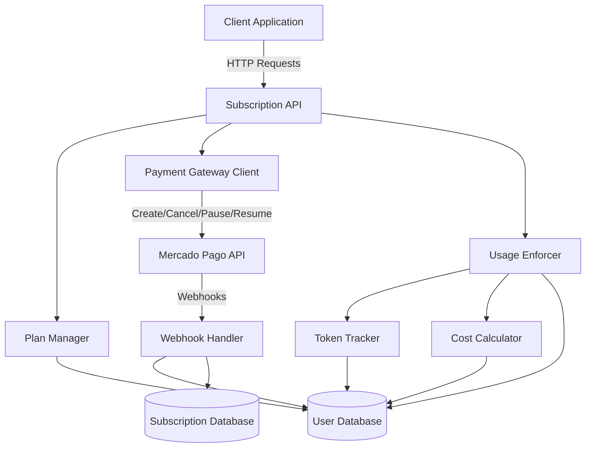

# Design Document: Mercado Pago Subscription System

## Overview

The Mercado Pago Subscription System is a comprehensive subscription management solution that integrates with Mercado Pago's payment processing platform to provide tiered subscription plans with usage-based limits. The system manages three subscription tiers (free, pro, enterprise) and enforces limits on clinical notes, recording minutes, OpenAI token usage, and API costs.

The system architecture follows a modular design with clear separation of concerns:
- Payment gateway integration for subscription lifecycle management
- Webhook processing for real-time payment and subscription status updates
- Usage tracking and enforcement for multiple resource types
- Database persistence for user subscriptions and billing metadata

Key design principles:
- **Idempotency**: Webhook processing handles duplicate notifications gracefully
- **Security**: Webhook validation ensures only legitimate Mercado Pago notifications are processed
- **Scalability**: Usage tracking is optimized for high-frequency API calls
- **Flexibility**: Sentinel values (-1) represent unlimited usage for enterprise features

## Architecture

### System Components



### Component Responsibilities

**Plan Manager**
- Defines subscription plan configurations (pricing, limits)
- Provides plan metadata to other components
- Maps plan names to limit values

**Payment Gateway Client**
- Interfaces with Mercado Pago PreApproval API
- Creates, cancels, pauses, and resumes subscriptions
- Formats external references for tracking
- Returns initialization URLs for user payment flow

**Webhook Handler**
- Receives and validates payment and PreApproval webhooks
- Parses external references to extract user and plan information
- Updates user subscription status and limits
- Logs webhook events for audit trail
- Implements idempotent processing

**Token Tracker**
- Records OpenAI token usage per user per billing month
- Retrieves current usage for limit enforcement
- Resets monthly counters at billing period boundaries

**Cost Calculator**
- Calculates OpenAI API costs based on model and token count
- Supports separate pricing for input and output tokens
- Provides high-precision cost calculations (4+ decimal places)

**Usage Enforcer**
- Pre-flight checks before allowing resource consumption
- Enforces limits for tokens, costs, clinical notes, and recording minutes
- Handles sentinel values for unlimited usage
- Returns descriptive error messages when limits are exceeded

### Data Flow

**Subscription Creation Flow**
1. Client requests subscription via API
2. API validates request and retrieves plan details
3. Payment Gateway creates PreApproval with Mercado Pago
4. PreApproval ID and metadata stored in Subscription Database
5. Initialization URL returned to client
6. User completes payment on Mercado Pago
7. Webhook received and processed
8. User Database updated with new plan and limits

**Usage Enforcement Flow**
1. Client attempts resource consumption (API call, note creation, recording)
2. Usage Enforcer retrieves current usage and limits from User Database
3. If limit is sentinel value (-1), allow operation
4. If limit is numeric, compare current usage to limit
5. If under limit, allow operation and increment usage counter
6. If at or over limit, reject operation with error

**Billing Period Reset Flow**
1. Webhook indicates new billing period start
2. Webhook Handler updates billing period dates in Subscription Database
3. Token Tracker resets monthly token and cost counters in User Database
4. Daily recording minutes reset occurs at day boundary (separate process)

## Components and Interfaces

### Plan Manager

```typescript
interface SubscriptionPlan {
  name: 'free' | 'pro' | 'enterprise';
  priceARS: number;
  limits: {
    clinicalNotesMonthly: number;  // -1 for unlimited
    recordingMinutesDaily: number;  // -1 for unlimited
    tokensMonthly: number;          // -1 for unlimited
    costMonthlyUSD: number;         // -1 for unlimited
  };
}

class PlanManager {
  getPlans(): SubscriptionPlan[];
  getPlan(name: string): SubscriptionPlan | null;
  getLimits(planName: string): SubscriptionPlan['limits'];
}
```

**Plan Definitions**
- Free: 0 ARS, limited resources
- Pro: Monthly fee in ARS, increased limits
- Enterprise: Higher monthly fee in ARS, unlimited or very high limits

### Payment Gateway Client

```typescript
interface PreApprovalRequest {
  userId: string;
  plan: string;
  priceARS: number;
  frequency: 'monthly';
  callbackUrl: string;
}

interface PreApprovalResponse {
  preApprovalId: string;
  initializationUrl: string;
  status: string;
}

interface SubscriptionAction {
  preApprovalId: string;
}

class PaymentGatewayClient {
  constructor(accessToken: string, publicKey: string);
  
  createPreApproval(request: PreApprovalRequest): Promise<PreApprovalResponse>;
  cancelSubscription(action: SubscriptionAction): Promise<void>;
  pauseSubscription(action: SubscriptionAction): Promise<void>;
  resumeSubscription(action: SubscriptionAction): Promise<void>;
  
  private formatExternalReference(userId: string, plan: string): string;
  // Returns: "user:{userId}|plan:{plan}"
}
```

### Webhook Handler

```typescript
interface PaymentWebhook {
  id: string;
  type: 'payment';
  data: {
    id: string;
  };
}

interface PreApprovalWebhook {
  id: string;
  type: 'preapproval';
  action: 'authorized' | 'cancelled' | 'paused' | 'failed';
  data: {
    id: string;
  };
}

interface ExternalReference {
  userId: string;
  plan: string;
}

class WebhookHandler {
  constructor(webhookSecret: string);
  
  validateWebhook(signature: string, payload: string): boolean;
  parseExternalReference(reference: string): ExternalReference;
  
  async handlePaymentWebhook(webhook: PaymentWebhook): Promise<void>;
  async handlePreApprovalWebhook(webhook: PreApprovalWebhook): Promise<void>;
  
  private async updateUserSubscription(userId: string, plan: string): Promise<void>;
  private async updateBillingPeriod(preApprovalId: string): Promise<void>;
  private async logWebhookEvent(event: any): Promise<void>;
}
```

**Idempotency Strategy**
- Store processed webhook IDs in database with timestamp
- Check webhook ID before processing
- Skip processing if webhook ID already exists
- Return 200 OK regardless to prevent retries

### Token Tracker

```typescript
interface TokenUsage {
  userId: string;
  billingMonth: string;  // Format: YYYY-MM
  tokensUsed: number;
  costUsedUSD: number;
}

class TokenTracker {
  async recordTokenUsage(userId: string, tokens: number): Promise<void>;
  async getCurrentUsage(userId: string): Promise<TokenUsage>;
  async resetMonthlyUsage(userId: string): Promise<void>;
  async canConsumeTokens(userId: string, estimatedTokens: number): Promise<boolean>;
}
```

### Cost Calculator

```typescript
interface ModelPricing {
  model: string;
  inputTokenPriceUSD: number;   // Price per 1000 tokens
  outputTokenPriceUSD: number;  // Price per 1000 tokens
}

interface CostCalculation {
  inputCost: number;
  outputCost: number;
  totalCost: number;
}

class CostCalculator {
  private pricingTable: Map<string, ModelPricing>;
  
  calculateCost(model: string, inputTokens: number, outputTokens: number): CostCalculation;
  getPricing(model: string): ModelPricing | null;
}
```

**Supported Models**
- GPT-4, GPT-4 Turbo, GPT-3.5 Turbo
- Pricing retrieved from configuration or external source
- Separate rates for input and output tokens

### Usage Enforcer

```typescript
interface UsageCheck {
  allowed: boolean;
  reason?: string;
  remaining?: number;
}

class UsageEnforcer {
  async checkTokenLimit(userId: string, estimatedTokens: number): Promise<UsageCheck>;
  async checkCostLimit(userId: string, estimatedCost: number): Promise<UsageCheck>;
  async checkClinicalNotesLimit(userId: string): Promise<UsageCheck>;
  async checkRecordingMinutesLimit(userId: string, minutes: number): Promise<UsageCheck>;
  
  async incrementClinicalNotes(userId: string): Promise<void>;
  async incrementRecordingMinutes(userId: string, minutes: number): Promise<void>;
  async incrementTokenUsage(userId: string, tokens: number, cost: number): Promise<void>;
}
```

### Subscription API

```typescript
interface CreateSubscriptionRequest {
  userId: string;
  plan: 'pro' | 'enterprise';
}

interface SubscriptionStatusResponse {
  userId: string;
  plan: string;
  status: 'active' | 'paused' | 'cancelled';
  limits: {
    clinicalNotesMonthly: number;
    clinicalNotesUsed: number;
    recordingMinutesDaily: number;
    recordingMinutesUsed: number;
    tokensMonthly: number;
    tokensUsed: number;
    costMonthlyUSD: number;
    costUsedUSD: number;
  };
  billingPeriod?: {
    start: string;
    end: string;
  };
}

class SubscriptionAPI {
  // POST /subscriptions
  async createSubscription(req: CreateSubscriptionRequest): Promise<PreApprovalResponse>;
  
  // DELETE /subscriptions/:userId
  async cancelSubscription(userId: string): Promise<void>;
  
  // POST /subscriptions/:userId/pause
  async pauseSubscription(userId: string): Promise<void>;
  
  // POST /subscriptions/:userId/resume
  async resumeSubscription(userId: string): Promise<void>;
  
  // GET /subscriptions/:userId
  async getSubscriptionStatus(userId: string): Promise<SubscriptionStatusResponse>;
  
  // GET /plans
  async getAvailablePlans(): Promise<SubscriptionPlan[]>;
  
  // POST /webhooks/payment
  async handlePaymentWebhook(req: Request): Promise<void>;
  
  // POST /webhooks/preapproval
  async handlePreApprovalWebhook(req: Request): Promise<void>;
}
```

**Authentication**
- JWT-based authentication for API endpoints
- Webhook endpoints use signature validation instead
- 401 Unauthorized for failed authentication
- User ID extracted from JWT claims

## Data Models

### User Database Schema

```sql
CREATE TABLE users (
  id UUID PRIMARY KEY,
  email VARCHAR(255) UNIQUE NOT NULL,
  
  -- Subscription information
  subscription_plan VARCHAR(50) NOT NULL DEFAULT 'free',
  subscription_status VARCHAR(50) NOT NULL DEFAULT 'active',
  
  -- Usage limits (from plan)
  clinical_notes_limit_monthly INTEGER NOT NULL DEFAULT 0,
  recording_minutes_limit_daily INTEGER NOT NULL DEFAULT 0,
  tokens_limit_monthly BIGINT NOT NULL DEFAULT 0,
  cost_limit_monthly_usd DECIMAL(10, 4) NOT NULL DEFAULT 0,
  
  -- Current usage (reset at billing period boundaries)
  clinical_notes_used_monthly INTEGER NOT NULL DEFAULT 0,
  recording_minutes_used_daily INTEGER NOT NULL DEFAULT 0,
  tokens_used_monthly BIGINT NOT NULL DEFAULT 0,
  cost_used_monthly_usd DECIMAL(10, 4) NOT NULL DEFAULT 0,
  
  -- Tracking timestamps
  billing_month VARCHAR(7),  -- Format: YYYY-MM
  daily_usage_date DATE,     -- For daily recording minutes reset
  
  created_at TIMESTAMP NOT NULL DEFAULT NOW(),
  updated_at TIMESTAMP NOT NULL DEFAULT NOW()
);

CREATE INDEX idx_users_subscription_plan ON users(subscription_plan);
CREATE INDEX idx_users_billing_month ON users(billing_month);
```

**Sentinel Value Handling**
- Value -1 represents unlimited usage
- Application logic checks for -1 before enforcing limits
- Database stores -1 as regular integer value

### Subscription Database Schema

```sql
CREATE TABLE subscriptions (
  id UUID PRIMARY KEY,
  user_id UUID NOT NULL REFERENCES users(id) ON DELETE CASCADE,
  
  -- Mercado Pago metadata
  preapproval_id VARCHAR(255) UNIQUE NOT NULL,
  plan VARCHAR(50) NOT NULL,
  status VARCHAR(50) NOT NULL,  -- authorized, cancelled, paused, failed
  
  -- Billing period
  billing_period_start DATE NOT NULL,
  billing_period_end DATE NOT NULL,
  
  -- Audit trail
  created_at TIMESTAMP NOT NULL DEFAULT NOW(),
  updated_at TIMESTAMP NOT NULL DEFAULT NOW()
);

CREATE INDEX idx_subscriptions_user_id ON subscriptions(user_id);
CREATE INDEX idx_subscriptions_preapproval_id ON subscriptions(preapproval_id);
CREATE INDEX idx_subscriptions_status ON subscriptions(status);
```

### Webhook Events Log Schema

```sql
CREATE TABLE webhook_events (
  id UUID PRIMARY KEY,
  webhook_id VARCHAR(255) UNIQUE NOT NULL,  -- For idempotency
  webhook_type VARCHAR(50) NOT NULL,        -- payment, preapproval
  payload JSONB NOT NULL,
  processed_at TIMESTAMP NOT NULL DEFAULT NOW(),
  
  -- Extracted information
  user_id UUID REFERENCES users(id),
  action VARCHAR(50),
  
  -- Security
  signature_valid BOOLEAN NOT NULL,
  
  created_at TIMESTAMP NOT NULL DEFAULT NOW()
);

CREATE INDEX idx_webhook_events_webhook_id ON webhook_events(webhook_id);
CREATE INDEX idx_webhook_events_user_id ON webhook_events(user_id);
CREATE INDEX idx_webhook_events_created_at ON webhook_events(created_at);
```

**Idempotency Implementation**
- Unique constraint on webhook_id prevents duplicate processing
- INSERT with ON CONFLICT DO NOTHING pattern
- Query webhook_events before processing to check if already handled

### Model Pricing Configuration

```sql
CREATE TABLE model_pricing (
  id UUID PRIMARY KEY,
  model_name VARCHAR(100) UNIQUE NOT NULL,
  input_token_price_usd DECIMAL(10, 8) NOT NULL,   -- Per 1000 tokens
  output_token_price_usd DECIMAL(10, 8) NOT NULL,  -- Per 1000 tokens
  effective_date DATE NOT NULL,
  created_at TIMESTAMP NOT NULL DEFAULT NOW()
);

CREATE INDEX idx_model_pricing_model_name ON model_pricing(model_name);
```

**Pricing Updates**
- New pricing rows inserted with effective_date
- Query uses effective_date <= current_date for active pricing
- Historical pricing preserved for audit purposes


## Correctness Properties

A property is a characteristic or behavior that should hold true across all valid executions of a system—essentially, a formal statement about what the system should do. Properties serve as the bridge between human-readable specifications and machine-verifiable correctness guarantees.

### Property 1: Plan Completeness

For any subscription plan defined in the system, the plan must include all required fields: name, price in ARS, monthly clinical notes limit, daily recording minutes limit, monthly token limit, and monthly cost limit in USD.

**Validates: Requirements 1.2, 1.3, 1.4, 1.5, 1.6**

### Property 2: Sentinel Value Consistency

For any limit field in any subscription plan, if the limit represents unlimited usage, the value must be exactly -1 (the sentinel value).

**Validates: Requirements 1.7**

### Property 3: External Reference Round Trip

For any user ID and plan name, formatting them into an external reference and then parsing that reference must yield the original user ID and plan name.

**Validates: Requirements 2.2, 4.3**

### Property 4: PreApproval Creation Completeness

For any subscription creation request, the PreApproval request sent to Mercado Pago must include the external reference, price in ARS, monthly billing frequency, and callback URL.

**Validates: Requirements 2.2, 2.3, 2.4**

### Property 5: PreApproval Persistence

For any successful PreApproval creation, the system must store a subscription record in the database that associates the PreApproval ID with the user ID.

**Validates: Requirements 2.6, 2.7**

### Property 6: Subscription Lifecycle Actions

For any subscription lifecycle action (cancel, pause, resume), the system must send the corresponding API request to Mercado Pago with the correct PreApproval ID and return either a success confirmation or a descriptive error message.

**Validates: Requirements 3.1, 3.2, 3.3, 3.4, 3.5**

### Property 7: Webhook Signature Validation

For any incoming webhook, if the signature is invalid, the system must reject the webhook, return an error response, and log a security event without processing the payload.

**Validates: Requirements 4.1, 4.7, 5.1, 13.3**

### Property 8: Payment Webhook Processing

For any valid payment webhook, the system must extract the external reference, parse the user ID and plan, update the user's subscription plan in the database, update all usage limits to match the new plan, and record the billing period start date.

**Validates: Requirements 4.2, 4.3, 4.4, 4.5, 4.6**

### Property 9: PreApproval Status Transitions

For any PreApproval webhook with action "authorized", "cancelled", "paused", or "failed", the system must update the subscription status accordingly: authorized → active status, cancelled → downgrade to free plan, paused → paused status, failed → failed status.

**Validates: Requirements 5.2, 5.3, 5.4, 5.5**

### Property 10: Webhook Event Logging

For any PreApproval status change webhook, the system must create a log entry that includes the timestamp, PreApproval ID, action, and user ID.

**Validates: Requirements 5.6**

### Property 11: Token Usage Accumulation

For any sequence of OpenAI API calls by a user within a billing month, the cumulative token count stored in the database must equal the sum of all tokens consumed in those calls.

**Validates: Requirements 6.1, 6.2, 6.3**

### Property 12: Monthly Token Reset

For any user, when a new billing month starts, the monthly token count must be reset to zero.

**Validates: Requirements 6.4**

### Property 13: Cost Calculation Accuracy

For any OpenAI API call with a known model, input token count, and output token count, the calculated cost must equal (input tokens × input price per 1000 / 1000) + (output tokens × output price per 1000 / 1000), with precision to at least 4 decimal places.

**Validates: Requirements 7.1, 7.2, 7.3, 7.4, 7.5**

### Property 14: Sentinel Value Bypass

For any resource type (tokens, cost, clinical notes, recording minutes), if a user's limit is set to the sentinel value (-1), any usage attempt must be allowed regardless of current usage.

**Validates: Requirements 8.3, 9.3, 14.3, 15.3**

### Property 15: Token Limit Enforcement

For any user with a non-sentinel token limit, if the current monthly token usage plus the estimated tokens for a new API call exceeds the limit, the system must reject the API call with a "limit exceeded" error.

**Validates: Requirements 8.4, 8.5, 8.6**

### Property 16: Cost Accumulation and Enforcement

For any OpenAI API call that completes, the system must calculate the actual cost incurred and add it to the user's monthly cost total, and if the total exceeds the user's cost limit (when not sentinel), subsequent API calls must be rejected with a "cost limit exceeded" error.

**Validates: Requirements 9.5, 9.6, 9.7**

### Property 17: Plan Change Synchronization

For any user whose subscription plan changes, all limit fields in the user database (clinical notes, recording minutes, tokens, cost) must be updated to exactly match the limits defined in the new plan.

**Validates: Requirements 10.9**

### Property 18: Billing Period Update

For any subscription, when a new billing period starts, the billing period start and end dates in the subscription database must be updated to reflect the new period.

**Validates: Requirements 11.7**

### Property 19: API Authentication Enforcement

For any API endpoint call (excluding webhook endpoints), if the request lacks valid authentication credentials, the system must return a 401 Unauthorized response without processing the request.

**Validates: Requirements 12.7, 12.8**

### Property 20: Webhook Payload Validation

For any incoming webhook, if the payload structure is invalid or malformed, the system must return a 400 Bad Request response without processing the webhook.

**Validates: Requirements 13.4, 13.5**

### Property 21: Webhook Success Response

For any incoming webhook with valid signature and payload structure, the system must return a 200 OK response after processing.

**Validates: Requirements 13.6**

### Property 22: Webhook Idempotency

For any webhook with a specific webhook ID, if the same webhook is received multiple times, the system must process it only once and return success for all subsequent identical requests.

**Validates: Requirements 13.7**

### Property 23: Clinical Notes Limit Enforcement

For any user with a non-sentinel clinical notes limit, if the current monthly notes count is less than the limit, creating a note must succeed and increment the count; if the count is at or above the limit, creating a note must be rejected with a "limit exceeded" error.

**Validates: Requirements 14.4, 14.5, 14.6**

### Property 24: Recording Minutes Limit Enforcement

For any user with a non-sentinel recording minutes limit, if the current daily minutes are less than the limit, recording must be allowed; if the minutes are at or above the limit, recording must be rejected with a "limit exceeded" error.

**Validates: Requirements 15.4, 15.5, 15.6**

### Property 25: Daily Recording Reset

For any user, when a new day starts, the daily recording minutes count must be reset to zero.

**Validates: Requirements 15.7**

### Property 26: Mercado Pago Token Usage

For any API request to Mercado Pago, the request must include the access token configured in the environment variables.

**Validates: Requirements 16.5**

### Property 27: Webhook Callback URL Inclusion

For any PreApproval creation request, the request must include the webhook callback URL configured in the environment variables.

**Validates: Requirements 17.2**

## Error Handling

### Webhook Processing Errors

**Invalid Signature**
- Response: 401 Unauthorized or 400 Bad Request
- Action: Log security event with timestamp, source IP, and payload hash
- No database changes

**Malformed Payload**
- Response: 400 Bad Request
- Action: Log validation error with payload structure details
- No database changes

**Database Errors During Processing**
- Response: 200 OK (to prevent Mercado Pago retries)
- Action: Log error and queue for manual review
- Implement retry logic with exponential backoff

**Duplicate Webhook**
- Response: 200 OK
- Action: Log duplicate detection
- No additional processing

### Payment Gateway Errors

**Mercado Pago API Unavailable**
- Action: Return 503 Service Unavailable to client
- Implement retry logic with exponential backoff (max 3 retries)
- Log all retry attempts

**Invalid PreApproval ID**
- Action: Return 404 Not Found to client
- Log error with user ID and attempted PreApproval ID

**Subscription Already Cancelled**
- Action: Return 409 Conflict to client
- Include current subscription status in response

**Network Timeout**
- Action: Return 504 Gateway Timeout to client
- Implement timeout of 30 seconds for Mercado Pago API calls

### Usage Limit Errors

**Token Limit Exceeded**
- Response: 429 Too Many Requests
- Body: `{"error": "monthly_token_limit_exceeded", "limit": X, "used": Y, "reset_date": "YYYY-MM-DD"}`
- Headers: `Retry-After: <seconds until reset>`

**Cost Limit Exceeded**
- Response: 429 Too Many Requests
- Body: `{"error": "monthly_cost_limit_exceeded", "limit_usd": X, "used_usd": Y, "reset_date": "YYYY-MM-DD"}`

**Clinical Notes Limit Exceeded**
- Response: 429 Too Many Requests
- Body: `{"error": "monthly_notes_limit_exceeded", "limit": X, "used": Y, "reset_date": "YYYY-MM-DD"}`

**Recording Minutes Limit Exceeded**
- Response: 429 Too Many Requests
- Body: `{"error": "daily_minutes_limit_exceeded", "limit": X, "used": Y, "reset_time": "HH:MM:SS"}`

### Configuration Errors

**Missing Environment Variables**
- Action: Fail application startup
- Log: "Configuration error: Missing required environment variable: {VAR_NAME}"
- Exit code: 1

**Invalid Pricing Configuration**
- Action: Fail application startup
- Log: "Configuration error: Invalid or missing pricing for model: {MODEL_NAME}"
- Exit code: 1

### Database Errors

**Connection Failure**
- Action: Fail application startup or return 503 during runtime
- Implement connection pooling with health checks
- Retry connection with exponential backoff

**Constraint Violation**
- Action: Return 409 Conflict to client
- Log violation details for debugging

**Transaction Deadlock**
- Action: Retry transaction up to 3 times
- If all retries fail, return 500 Internal Server Error
- Log deadlock occurrence for monitoring

## Testing Strategy

### Unit Testing

Unit tests will focus on specific examples, edge cases, and component isolation:

**Plan Manager**
- Verify all three plans (free, pro, enterprise) are defined
- Verify sentinel values are used correctly for unlimited limits
- Test plan lookup by name

**Payment Gateway Client**
- Test external reference formatting with various user IDs and plan names
- Test PreApproval request construction with all required fields
- Mock Mercado Pago API responses for success and error cases

**Webhook Handler**
- Test signature validation with valid and invalid signatures
- Test external reference parsing with valid and malformed formats
- Test idempotency with duplicate webhook IDs
- Test each PreApproval action (authorized, cancelled, paused, failed)

**Token Tracker**
- Test token accumulation across multiple API calls
- Test monthly reset logic
- Test usage retrieval for current billing month

**Cost Calculator**
- Test cost calculation with known pricing and token counts
- Test precision (4+ decimal places)
- Test separate input/output token pricing

**Usage Enforcer**
- Test enforcement at exact limit boundary
- Test enforcement one below limit (should allow)
- Test enforcement one above limit (should reject)
- Test sentinel value bypass for each resource type

### Property-Based Testing

Property-based tests will verify universal properties across randomized inputs. Each test will run a minimum of 100 iterations.

**Testing Library**: Use `fast-check` for TypeScript/JavaScript or `hypothesis` for Python

**Property Test Configuration**:
```typescript
// Example configuration
fc.assert(
  fc.property(/* generators */, (/* inputs */) => {
    // Property assertion
  }),
  { numRuns: 100 }
);
```

**Property Tests to Implement**:

1. **External Reference Round Trip** (Property 3)
   - Tag: `Feature: mercado-pago-subscription-system, Property 3: External reference round trip`
   - Generators: Random user IDs (UUIDs), random plan names from enum
   - Assertion: `parse(format(userId, plan)) === {userId, plan}`

2. **Plan Completeness** (Property 1)
   - Tag: `Feature: mercado-pago-subscription-system, Property 1: Plan completeness`
   - Generators: Iterate over all plans
   - Assertion: Each plan has all required fields with valid types

3. **Sentinel Value Consistency** (Property 2)
   - Tag: `Feature: mercado-pago-subscription-system, Property 2: Sentinel value consistency`
   - Generators: Iterate over all plans and all limit fields
   - Assertion: Unlimited limits are exactly -1

4. **Token Usage Accumulation** (Property 11)
   - Tag: `Feature: mercado-pago-subscription-system, Property 11: Token usage accumulation`
   - Generators: Random user ID, random array of token counts (1-10000)
   - Assertion: Sum of recorded tokens equals cumulative total in database

5. **Cost Calculation Accuracy** (Property 13)
   - Tag: `Feature: mercado-pago-subscription-system, Property 13: Cost calculation accuracy`
   - Generators: Random model from supported list, random input tokens (1-100000), random output tokens (1-100000)
   - Assertion: Calculated cost matches manual calculation with 4+ decimal precision

6. **Sentinel Value Bypass** (Property 14)
   - Tag: `Feature: mercado-pago-subscription-system, Property 14: Sentinel value bypass`
   - Generators: Random resource type, random usage amount (0-1000000)
   - Assertion: When limit is -1, usage check always returns allowed

7. **Token Limit Enforcement** (Property 15)
   - Tag: `Feature: mercado-pago-subscription-system, Property 15: Token limit enforcement`
   - Generators: Random limit (100-100000), random current usage (0-limit), random estimated tokens (1-10000)
   - Assertion: Rejection occurs if and only if usage + estimated > limit

8. **Plan Change Synchronization** (Property 17)
   - Tag: `Feature: mercado-pago-subscription-system, Property 17: Plan change synchronization`
   - Generators: Random user, random old plan, random new plan
   - Assertion: After plan change, all user limit fields match new plan definition

9. **Webhook Idempotency** (Property 22)
   - Tag: `Feature: mercado-pago-subscription-system, Property 22: Webhook idempotency`
   - Generators: Random webhook payload with random webhook ID
   - Assertion: Processing same webhook N times (N=2-10) produces same database state as processing once

10. **Clinical Notes Limit Enforcement** (Property 23)
    - Tag: `Feature: mercado-pago-subscription-system, Property 23: Clinical notes limit enforcement`
    - Generators: Random limit (1-1000), random current count (0-limit+10)
    - Assertion: Note creation allowed if count < limit, rejected if count >= limit

11. **Recording Minutes Limit Enforcement** (Property 24)
    - Tag: `Feature: mercado-pago-subscription-system, Property 24: Recording minutes limit enforcement`
    - Generators: Random limit (1-1000), random current minutes (0-limit+10)
    - Assertion: Recording allowed if minutes < limit, rejected if minutes >= limit

12. **API Authentication Enforcement** (Property 19)
    - Tag: `Feature: mercado-pago-subscription-system, Property 19: API authentication enforcement`
    - Generators: Random API endpoint from list, random invalid auth token
    - Assertion: All endpoints return 401 for invalid auth

### Integration Testing

Integration tests will verify component interactions and external service integration:

**Database Integration**
- Test user and subscription CRUD operations
- Test transaction rollback on errors
- Test concurrent access and locking

**Mercado Pago API Integration**
- Use Mercado Pago sandbox environment
- Test full subscription creation flow
- Test webhook delivery and processing
- Test error responses from Mercado Pago

**End-to-End Flows**
- Complete subscription creation: API call → PreApproval → webhook → database update
- Subscription cancellation: API call → Mercado Pago → webhook → downgrade to free
- Usage enforcement: Multiple API calls → limit reached → rejection
- Billing period transition: Webhook → reset counters → new period

### Test Data Management

**Fixtures**
- Predefined user accounts with known subscription states
- Sample webhook payloads for each event type
- Model pricing data for cost calculations

**Database Seeding**
- Reset database to known state before each test suite
- Use transactions for test isolation
- Clean up test data after test completion

**Mocking Strategy**
- Mock Mercado Pago API for unit tests
- Use real database (test instance) for integration tests
- Mock time/date functions for testing resets and billing periods

### Performance Testing

**Load Testing**
- Simulate 1000 concurrent API calls
- Measure response times for usage enforcement checks
- Verify database connection pool handles load

**Webhook Processing**
- Test processing 100 webhooks per second
- Verify idempotency under high load
- Measure database write throughput

**Usage Tracking**
- Test token tracking for 10,000 API calls per user per month
- Verify query performance for usage retrieval
- Test index effectiveness on large datasets

