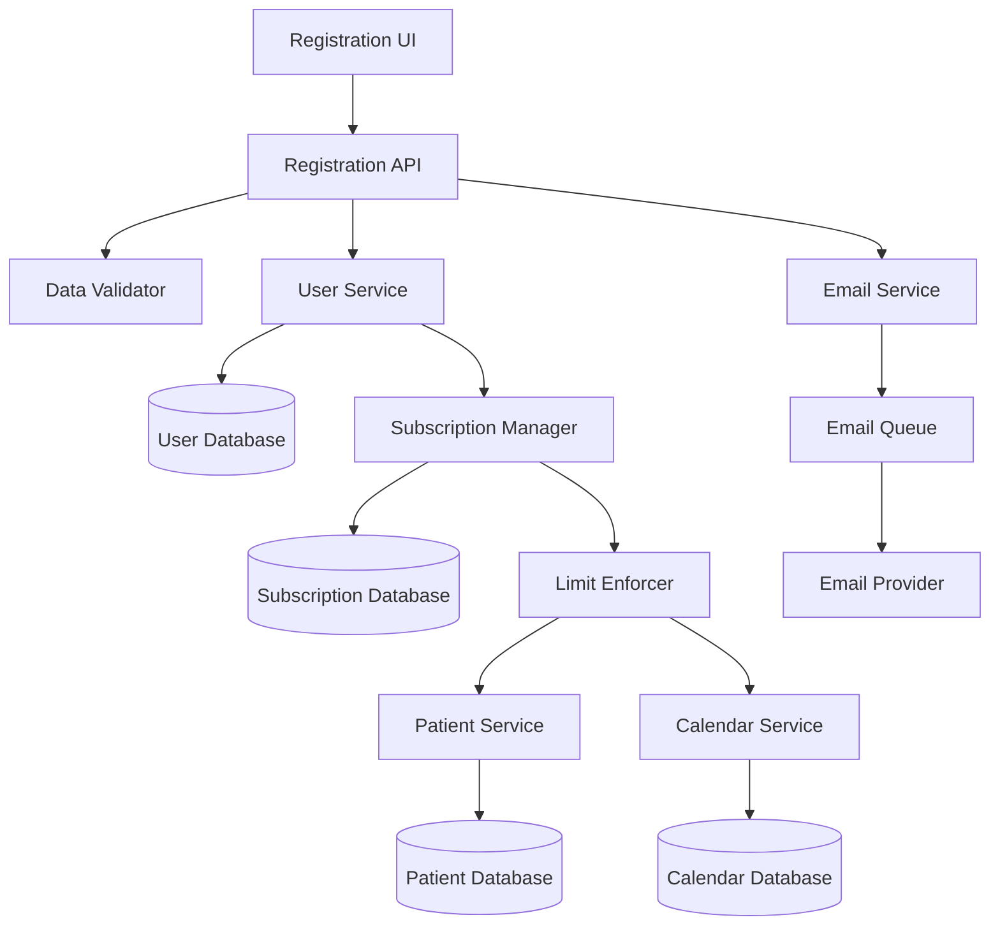

# Design Document: User Self-Registration Free Tier

## Overview

This design implements a self-service user registration system that automatically assigns new users to a free subscription tier. The system eliminates the need for super admin intervention in user creation while maintaining security through email verification and proper data validation.

The free tier provides core patient management functionality (up to 5 patients) while restricting access to premium features like calendar functionality. This creates a clear upgrade path for users who need additional capabilities.

Key design principles:
- **Security First**: All registration data is validated and sanitized
- **Automated Onboarding**: Users can start using the system immediately after email verification
- **Clear Boundaries**: Free tier limitations are enforced consistently across the application
- **Upgrade Ready**: Architecture supports seamless subscription tier transitions

## Architecture

The system follows a modular architecture with clear separation of concerns:



### Core Components

1. **Registration API**: Handles registration requests and orchestrates the registration process
2. **Data Validator**: Validates and sanitizes all input data
3. **User Service**: Manages user account creation and lifecycle
4. **Subscription Manager**: Handles subscription tier assignment and management
5. **Email Service**: Manages email verification and notifications
6. **Limit Enforcer**: Enforces subscription-based feature restrictions

## Components and Interfaces

### Registration API

**Responsibilities:**
- Process registration requests
- Coordinate validation, user creation, and email verification
- Handle registration errors and responses

**Key Methods:**
```typescript
interface RegistrationAPI {
  registerUser(registrationData: RegistrationRequest): Promise<RegistrationResponse>
  verifyEmail(token: string): Promise<VerificationResponse>
  resendVerification(email: string): Promise<ResendResponse>
}
```

### Data Validator

**Responsibilities:**
- Validate email format and uniqueness
- Enforce password strength requirements
- Sanitize input data to prevent injection attacks
- Validate required fields

**Key Methods:**
```typescript
interface DataValidator {
  validateEmail(email: string): ValidationResult
  validatePassword(password: string): ValidationResult
  validateRequiredFields(data: RegistrationData): ValidationResult
  sanitizeInput(input: string): string
}
```

### User Service

**Responsibilities:**
- Create and manage user accounts
- Handle user authentication state
- Manage user profile information

**Key Methods:**
```typescript
interface UserService {
  createUser(userData: UserData): Promise<User>
  getUserByEmail(email: string): Promise<User | null>
  activateUser(userId: string): Promise<void>
  updateUserProfile(userId: string, updates: UserUpdates): Promise<User>
}
```

### Subscription Manager

**Responsibilities:**
- Assign subscription tiers to users
- Track subscription limits and usage
- Handle subscription upgrades and downgrades

**Key Methods:**
```typescript
interface SubscriptionManager {
  assignFreeTier(userId: string): Promise<Subscription>
  getSubscription(userId: string): Promise<Subscription>
  upgradeSubscription(userId: string, newTier: SubscriptionTier): Promise<Subscription>
  checkLimit(userId: string, resource: ResourceType): Promise<LimitCheck>
}
```

### Email Service

**Responsibilities:**
- Send verification emails
- Generate and validate verification tokens
- Handle email delivery failures

**Key Methods:**
```typescript
interface EmailService {
  sendVerificationEmail(email: string, token: string): Promise<void>
  generateVerificationToken(userId: string): Promise<string>
  validateVerificationToken(token: string): Promise<TokenValidation>
}
```

### Limit Enforcer

**Responsibilities:**
- Enforce subscription-based limits across the application
- Provide consistent limit checking interface
- Handle limit exceeded scenarios

**Key Methods:**
```typescript
interface LimitEnforcer {
  canCreatePatient(userId: string): Promise<boolean>
  canAccessCalendar(userId: string): Promise<boolean>
  getPatientCount(userId: string): Promise<number>
  incrementPatientCount(userId: string): Promise<void>
  decrementPatientCount(userId: string): Promise<void>
}
```

## Data Models

### User Model
```typescript
interface User {
  id: string
  email: string
  passwordHash: string
  firstName: string
  lastName: string
  isVerified: boolean
  createdAt: Date
  updatedAt: Date
  subscriptionId: string
}
```

### Subscription Model
```typescript
interface Subscription {
  id: string
  userId: string
  tier: SubscriptionTier
  patientLimit: number
  hasCalendarAccess: boolean
  startDate: Date
  endDate?: Date
  status: SubscriptionStatus
}

enum SubscriptionTier {
  FREE = 'free',
  BASIC = 'basic',
  PREMIUM = 'premium'
}

enum SubscriptionStatus {
  ACTIVE = 'active',
  EXPIRED = 'expired',
  CANCELLED = 'cancelled'
}
```

### Registration Request Model
```typescript
interface RegistrationRequest {
  email: string
  password: string
  confirmPassword: string
  firstName: string
  lastName: string
  acceptedTerms: boolean
  acceptedPrivacy: boolean
}
```

### Verification Token Model
```typescript
interface VerificationToken {
  id: string
  userId: string
  token: string
  expiresAt: Date
  used: boolean
  createdAt: Date
}
```

### Patient Count Model
```typescript
interface PatientCount {
  userId: string
  count: number
  lastUpdated: Date
}
```

## Correctness Properties

*A property is a characteristic or behavior that should hold true across all valid executions of a system-essentially, a formal statement about what the system should do. Properties serve as the bridge between human-readable specifications and machine-verifiable correctness guarantees.*

### Property 1: Valid Registration Creates Account

*For any* valid registration data (proper email format, strong password, required fields), the Registration_System should successfully create a new user account with the provided information.

**Validates: Requirements 1.1**

### Property 2: Email Format Validation

*For any* email string, the Registration_System should accept it if and only if it matches valid email format standards (RFC 5322 compliant).

**Validates: Requirements 1.2, 5.1**

### Property 3: Password Strength Validation

*For any* password string, the Registration_System should accept it if and only if it contains at least 8 characters with uppercase, lowercase, and numeric characters.

**Validates: Requirements 1.3, 5.2**

### Property 4: Confirmation Email Sending

*For any* successful user registration, the Email_System should send exactly one confirmation email containing a unique verification token.

**Validates: Requirements 1.5, 6.1**

### Property 5: Free Tier Assignment

*For any* newly registered user, the Subscription_Manager should automatically assign a free tier subscription with patient limit of 5 and calendar access disabled.

**Validates: Requirements 2.1, 2.2, 2.3**

### Property 6: Subscription Data Recording

*For any* subscription assignment, the Subscription_Manager should record the subscription tier, start date, and limit information in persistent storage.

**Validates: Requirements 2.4**

### Property 7: Patient Creation Within Limits

*For any* free tier user with fewer than 5 patients, the Patient_Manager should allow creation of additional patients up to the limit of 5.

**Validates: Requirements 3.1**

### Property 8: Patient Management Operations

*For any* patient owned by a user within their subscription limits, the Patient_Manager should allow full CRUD operations (create, read, update, delete).

**Validates: Requirements 3.3**

### Property 9: Patient Count Updates

*For any* patient deletion, the Patient_Manager should decrement the user's patient count, allowing creation of new patients if previously at limit.

**Validates: Requirements 3.4**

### Property 10: Calendar Access Restriction

*For any* free tier user and any calendar operation (create, view, edit appointments), the Calendar_System should deny access and display upgrade prompts.

**Validates: Requirements 4.1, 4.2, 4.4**

### Property 11: Navigation Menu Hiding

*For any* free tier user, the Navigation_System should exclude calendar menu items from the user interface.

**Validates: Requirements 4.3**

### Property 12: Required Field Validation

*For any* registration attempt missing required fields (email, password, firstName, lastName), the Registration_System should reject the registration with specific error messages.

**Validates: Requirements 5.3, 5.4**

### Property 13: Input Sanitization

*For any* registration input containing potentially malicious content, the Registration_System should sanitize the input to prevent injection attacks while preserving legitimate data.

**Validates: Requirements 5.5**

### Property 14: Account Verification State

*For any* newly created account, the Registration_System should mark it as unverified until email confirmation is completed.

**Validates: Requirements 6.2**

### Property 15: Account Activation

*For any* valid verification token, the Registration_System should activate the corresponding account and mark it as verified.

**Validates: Requirements 6.3**

### Property 16: Login Prevention for Unverified Accounts

*For any* unverified user account, the Authentication_System should prevent login attempts and return appropriate error messages.

**Validates: Requirements 6.4**

### Property 17: Token Expiration and Resend

*For any* verification token older than 24 hours, the Registration_System should treat it as expired and allow generation of new verification tokens.

**Validates: Requirements 6.5**

### Property 18: Upgrade Prompts at Limits

*For any* free tier user who reaches their patient limit, the Upgrade_System should display available subscription upgrade options.

**Validates: Requirements 8.1**

### Property 19: Upgrade Menu Presence

*For any* free tier user, the Navigation_System should include upgrade options in the user menu interface.

**Validates: Requirements 8.3**

### Property 20: Data Preservation During Upgrades

*For any* user subscription upgrade, the Upgrade_System should preserve all existing user data (patients, profile information) while updating subscription limits.

**Validates: Requirements 8.4**

## Error Handling

The system implements comprehensive error handling across all components:

### Registration Errors
- **Invalid Email Format**: Return specific validation error with format requirements
- **Weak Password**: Return detailed password strength requirements
- **Missing Required Fields**: Return field-specific error messages
- **Duplicate Email**: Return user-friendly error suggesting login instead
- **Email Service Failure**: Queue email for retry and notify user of delay

### Subscription Errors
- **Limit Exceeded**: Display current usage and upgrade options
- **Subscription Service Unavailable**: Allow registration but queue subscription assignment
- **Invalid Subscription Tier**: Log error and assign default free tier

### Verification Errors
- **Invalid Token**: Return clear error message with resend option
- **Expired Token**: Automatically offer to resend verification email
- **Already Verified**: Redirect to login page with success message

### Database Errors
- **Connection Failures**: Implement retry logic with exponential backoff
- **Constraint Violations**: Return user-friendly error messages
- **Transaction Failures**: Rollback changes and return appropriate error

### Rate Limiting
- **Registration Attempts**: Limit to 5 attempts per IP per hour
- **Email Verification**: Limit resend requests to 3 per hour per email
- **Login Attempts**: Implement progressive delays after failed attempts

## Testing Strategy

The testing approach combines unit testing for specific scenarios with property-based testing for comprehensive coverage across all possible inputs.

### Unit Testing Focus
Unit tests will cover specific examples, edge cases, and integration points:

- **Registration Flow Integration**: Test complete registration process with valid data
- **Email Service Integration**: Verify email sending with actual email service
- **Database Integration**: Test data persistence and retrieval
- **Authentication Integration**: Verify login/logout functionality
- **Subscription Upgrade Flow**: Test tier transition scenarios
- **Error Boundary Cases**: Test specific error conditions and recovery

### Property-Based Testing Configuration

Property-based tests will use **fast-check** library for JavaScript/TypeScript with minimum 100 iterations per test. Each test will be tagged with comments referencing the design document property.

**Example Test Structure:**
```typescript
// Feature: user-self-registration-free-tier, Property 1: Valid Registration Creates Account
fc.assert(fc.property(
  validRegistrationDataGenerator(),
  async (registrationData) => {
    const result = await registrationAPI.registerUser(registrationData);
    expect(result.success).toBe(true);
    expect(result.user.email).toBe(registrationData.email);
  }
), { numRuns: 100 });
```

**Property Test Coverage:**
- **Input Validation**: Test all validation rules with generated valid/invalid inputs
- **Subscription Management**: Test tier assignment and limit enforcement
- **Email Verification**: Test token generation, validation, and expiration
- **Patient Management**: Test CRUD operations within subscription limits
- **Calendar Restrictions**: Test access control across all calendar features
- **Data Integrity**: Test data preservation during state transitions

**Test Data Generators:**
- **Valid Registration Data**: Generate realistic user registration information
- **Invalid Email Formats**: Generate various malformed email addresses
- **Weak Passwords**: Generate passwords that violate strength requirements
- **Malicious Input**: Generate potential injection attack vectors
- **Subscription Scenarios**: Generate various subscription states and transitions

The dual testing approach ensures both concrete functionality (unit tests) and universal correctness (property tests) are validated, providing comprehensive coverage for the user self-registration system.